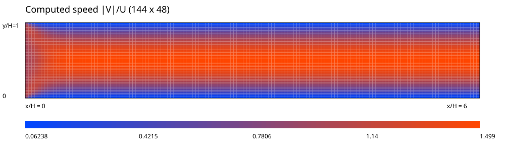
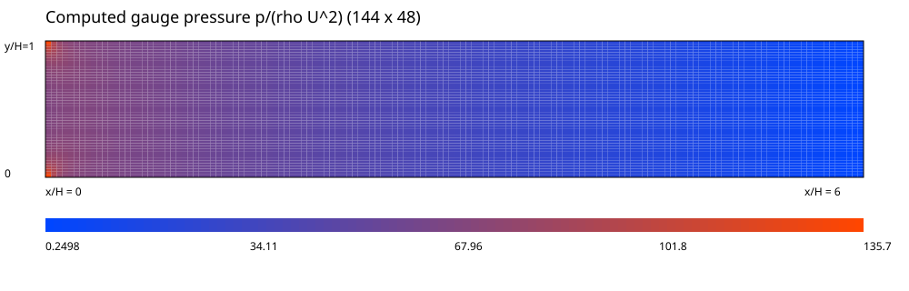

Poiseuille benchmark 计算说明
=============================

验证范围与参考解
----------------

本算例对标二维平行板充分发展层流的 Poiseuille 解析解，而不是圆柱或
NACA 公开绕流数据。它验证笛卡尔有限体积离散、壁面条件及 SIMPLE 耦合；
不能据此宣称贴体网格、圆柱阻力或翼型升阻力误差小于 3%。

参考：`Plane Poiseuille flow
<https://en.wikipedia.org/wiki/Hagen%E2%80%93Poiseuille_equation#Plane_Poiseuille_flow>`_。
由稳态充分发展方程 ``mu * d²u/dy² = dp/dx``、两壁无滑移及
截面平均速度 U 得到独立解析解：

* ``u_ref(y) = 6 U (y/H) (1-y/H)``，``v_ref = 0``；
* ``(dp/dx)_ref = -12 mu U / H² = -12``。

设置与复现
----------

H=1，L=6，U=1，rho=1，Re_H=1，mu=1，无圆柱；
入口均匀速度，上下壁面无滑移，出口零表压、预测速度零法向梯度。
因此入口段并非充分发展，不能用全域速度或入口总压降与充分发展解析解比较。
初始化为求解器默认均匀速度、零压力，不植入解析解。

float64，CPU 单线程；速度/压力欠松弛 0.7/0.3，
最大迭代 1000 次，连续性、动量及质量不平衡容差均为 1e-6。
运行环境：Python 3.12.3，PyTorch 2.14.1+cu130。
在仓库根目录安装项目后运行（再次运行会覆盖同名输出）::

    python -m tensorfvm.benchmark --output results/benchmark

返回码 0 表示所有网格已收敛且每项误差严格小于 3%；2 表示未达标，
1 表示运行失败。失败计算也保留诊断数据，不隐藏或截断误差。
每档网格的 fields.csv、history.json、summary.json 保留完整场与残差；
benchmark.json 为机器可读验收数据，profiles.csv 为速度对标数据。

误差定义与结果
--------------

速度取最接近 x=5H 的单元中心截面，与同一 y 坐标的解析解比较：
``E_L2 = ||u-u_ref||₂ / ||u_ref||₂``；
``E_Linf = max|u-u_ref| / max|u_ref|``。
后者是以截面最大参考速度归一化的误差，不是近壁逐点相对误差。
压力取 3H ≤ x ≤ 5H 的截面平均值作最小二乘直线拟合，
``E_p = |slope-slope_ref| / |slope_ref|``。
比较梯度避开表压参考值和入口附加压降；各误差独立检验，不作平均。

.. list-table:: 实际计算误差（严格阈值 < 3%）
   :header-rows: 1

   * - 网格 nx × ny
     - 迭代次数
     - 截面 x/H
     - 速度 L2
     - 速度 Linf
     - 压力梯度
     - 验收
   * - 36 × 12
     - 41
     - 5.08333
     - 0.6344%
     - 0.6801%
     - 1.3699%
     - 通过
   * - 72 × 24
     - 87
     - 5.04167
     - 0.1620%
     - 0.1738%
     - 0.3440%
     - 通过
   * - 144 × 48
     - 282
     - 5.02083
     - 0.0428%
     - 0.0480%
     - 0.0784%
     - 通过

总体结论：全部通过。
更粗的 24 × 8 网格在相同设置下压梯度误差约 3.03%，不满足阈值，
已作为回归测试中的拒绝案例；以上三档网格才是正式验收网格。
最细网格连续性残差 1.3458e-14，
动量残差 9.70775e-07，
质量不平衡 0。
网格加密结果用于观察离散误差趋势，不代替无限域或绕流 benchmark 验证。

计算云图
--------

以下均来自最细网格实际数值解（单元常值着色，无解析解替换、插值平滑或
纵横比例拉伸）。x 从左向右，y 从下向上；色标为对应无量纲值。

速度图可见入口发展及下游抛物线分布，压力图可见下游近线性降压。
