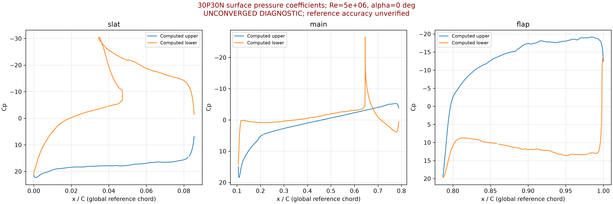

# 30P30N geometry and actual flow preview

UNCONVERGED DIAGNOSTIC: not a validated flow solution

These pressure and velocity fields are actual saved SIMPLE/SA cell fields after 2 completed iterations, not the overset manufactured scalar solution. Re=5,000,000, alpha=0 degrees. This flow solve uses one body-fitted Gmsh mesh; it does not implement overset Navier-Stokes coupling. They must not be used as accepted aerodynamic results.

[Raw fields](fields.csv) | [Residual history](history.json) | [PDF](flow-report.pdf)

## 三段翼表面压力系数

[完整Cp说明及原始数据](cp-report.md)。计算仍未收敛，同工况实验参考Cp数据缺失，尚未完成物理精度对比。
