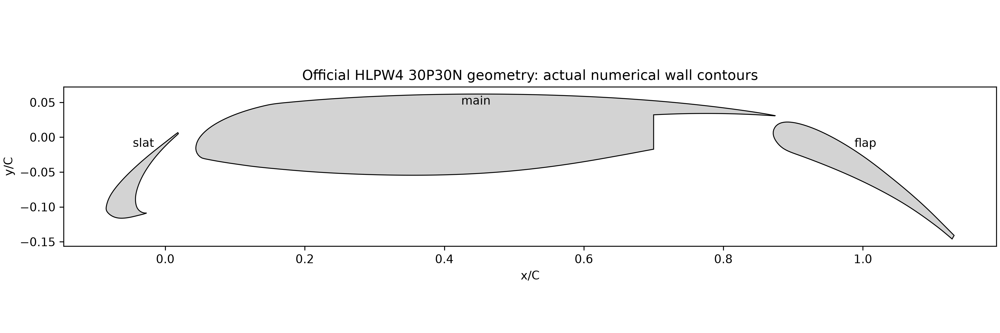
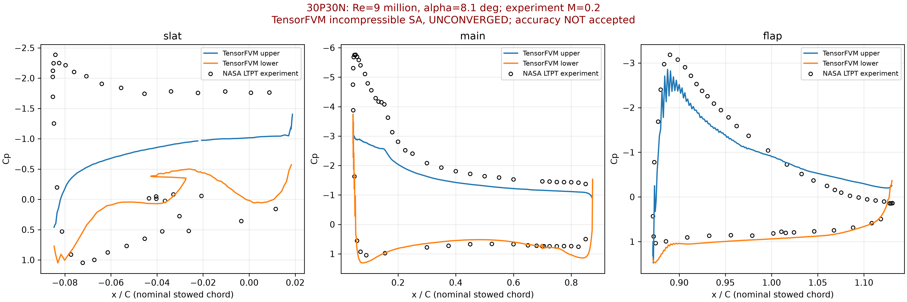
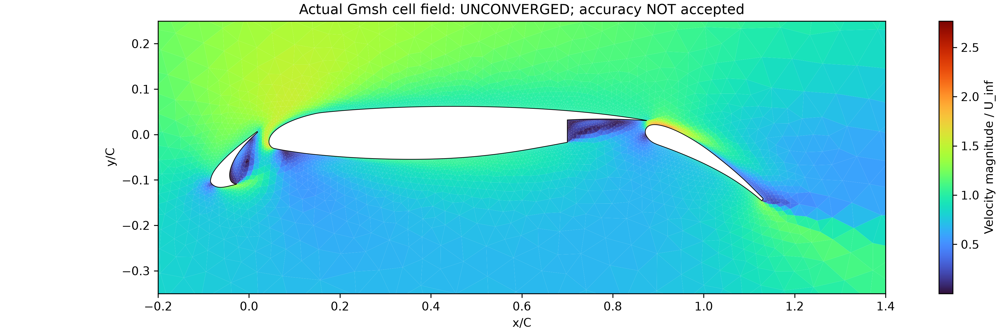
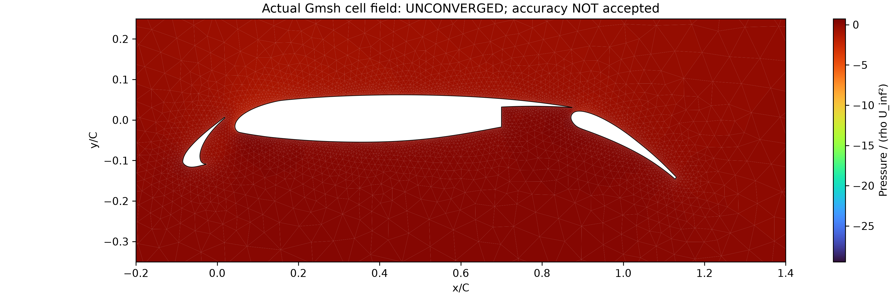
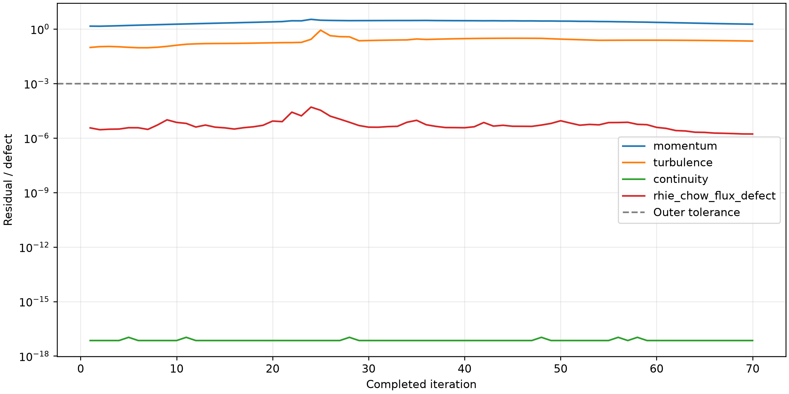

# 30P30N 三段翼：实际计算与 NASA LTPT 压力数据比较

## 问题与参考来源

官方 HLPW4 辅助案例包提供 BANC 三段翼几何，以及 NASA Langley LTPT 原始实验数据。参考为名义收起弦长 C=1，Re=9×10⁶，M=0.2，攻角 8.1°。几何坐标由官方 18 英寸曲线除以 18 得到，壁面表示为 official sampled polygon，节点到原始几何的距离见 geometry-validation.json；保留缝道和尾缘厚度。官方规定远场半径 500C。原包特别说明 BANC 缝翼尾缘较原实验厚，实验存在三维效应，数据只能作为粗略指南。

[官方归档](https://hlpw4.s3.us-east-1.amazonaws.com/website/Workshop4.zip)：`Workshop4/AuxTestCase_HLPW4_30p30n_v1.tar.gz`；原始数据及 SHA256 见 reference-metadata.json。

## 软件与计算方法

共享 Mesh2D 有限体积模块，Gmsh 壁面结构化层与外部三角网格；不可压 SIMPLE、全湍流 Spalart–Allmaras、受限线性迎风动量重构。压力梯度=gauss-skew-corrected；粘性应力=full symmetric deviatoric variable viscosity；SA 更新=standard positive-production Picard update。每次压力矩阵与实际离散算子独立核对，线性方程检验真实残差。远场上游给定速度、下游给定零表压，这是当前不可压近似边界条件。启动阶段的迎风混合系数见残差记录；尚未进入完整重构阶段的检查点不构成目标离散格式的收敛解。

网格包含 53,490 个真实单元，完成 70 次迭代。数值收敛=False。未将实验 Cp、Cl 或 Cd 输入求解方程。

## 实际计算结果

实验 Cl=3.1354；实际计算 Cl=2.47063；相对误差=21.202%。这不能单独替代 Cp 与网格收敛验收。原 Wolf Dynamics 的 Cl=2.167089、Cd=0.033243 属于另一工况，未用于本表。

| 翼段 | 表面 | 无歧义支持点/实验点 | 支持点 Cp 相对 L2 误差 |
|---|---|---|---|
| slat | upper | 12/16 | 78.368% |
| slat | lower | 13/21 | 98.110% |
| main | upper | 33/34 | 42.405% |
| main | lower | 21/21 | 31.265% |
| flap | upper | 29/30 | 28.458% |
| flap | lower | 18/18 | 29.409% |

全部实验点均显示，定量误差仅使用相邻真实壁面压力可无歧义插值的位置。未对多值 x 的缝翼凹腔排序平均，未外推到网格支持范围外。被排除点逐一记录，支持点误差不能称为完整表面误差。壁面压力方法=Actual solver skew-corrected wall face pressure; prescribed outlet p_inf=0；仍需细化验证。

## 验收结论

物理精度验收=False，尚未证明完整 Cp 误差低于 3%。

- Compressible experiment versus incompressible model
- Geometry exception: thicker BANC slat trailing edge
- Experimental three-dimensional effects/unknown uncertainty
- Grid independence has not been demonstrated
- Numerical residuals have not converged
- Incomplete unambiguous pressure tap registration

[完整 PDF](hlpw-report.pdf) · [逐测点对比](cp-reference-comparison.csv) · [验收记录](cp-validation.json)
