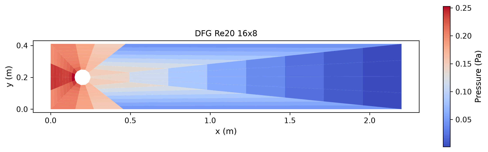
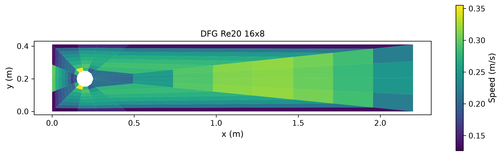
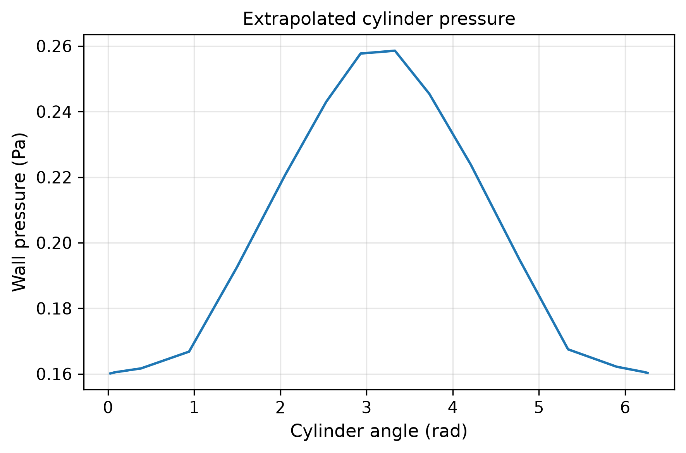
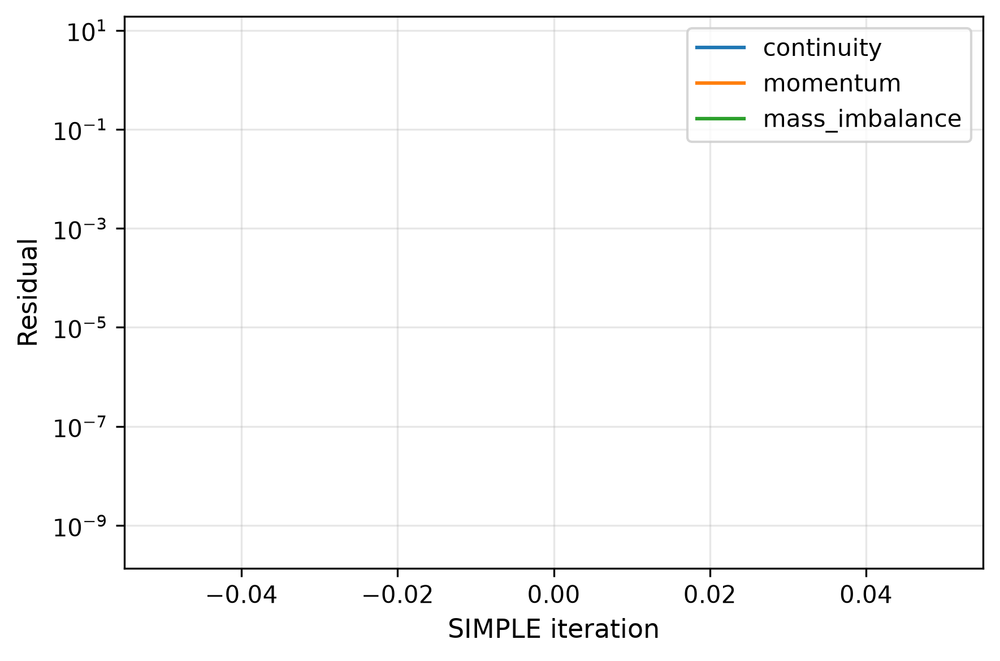

# DFG 2D-1 Re20 圆柱绕流诊断报告

## 问题与参考

通道 2.2×0.41 m，圆心 (0.2,0.2) m，直径0.1 m，ρ=1，μ=0.001 Pa·s，入口抛物线平均速度0.2 m/s，Re=20；固壁无滑移、出口定压。

公开高精度参考 Cd=5.57953523384，Cl=0.010618948146，前后压力差0.11752016697 Pa。来源：[FeatFlow DFG 2D-1](https://wwwold.mathematik.tu-dortmund.de/~featflow/en/benchmarks/cfdbenchmarking/flow/dfg_benchmark1_re20.html)。三个物理指标分别严格 <3%，残差收敛不能代替物理精度。

## 软件与证据

采用现有贴体 O-grid SIMPLE/Rhie–Chow 求解器。压力差按壁面外推和角度插值得到，该近似会贡献误差。共用 Metric/evaluate/save_run 与 publication figure；完整字段、网格、质量面通量、压力/黏性分力和壁面梯度保存于 NPZ。独立 NumPy 审计积分这些保存字段；未声称独立重跑全部 SIMPLE。

复现：

~~~bash
OMP_NUM_THREADS=1 MKL_NUM_THREADS=1 PYTHONPATH=src python -m tensorfvm.verification.dfg --output results/dfg --grids 64x24
# 后续细化：--grids 64x24 128x48 256x96
~~~

## 结果

| 网格 | 收敛 | Cd/误差 | Cl/误差 | Δp/误差 | 全部通过 |
|---|---|---|---|---|---|
| 16x8 | False | 7.0565722 / 26.4724% | 0.090167404 / 749.1180% | 0.097927878 / 16.6714% | False |

## 结论与推进

这是实际求解并归档的诊断材料。单网格不证明网格收敛；任何未通过指标保留，不调参考或放宽3%门。下一步做网格、壁面牵引及压力重建的误差分解，再执行三网格细化。没有同条件 LBM 圆柱结果，因此不作圆柱 FVM/LBM 优劣排名。

