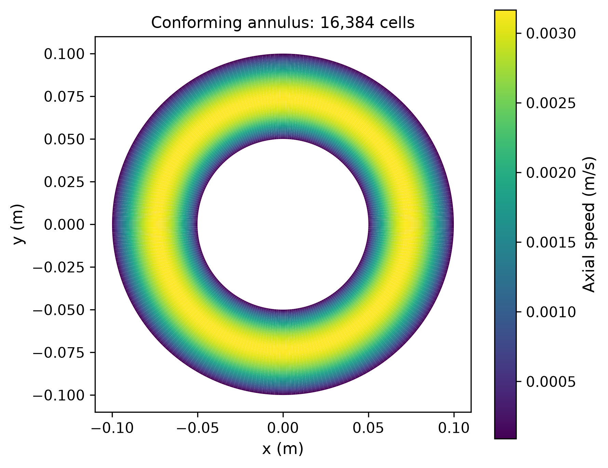
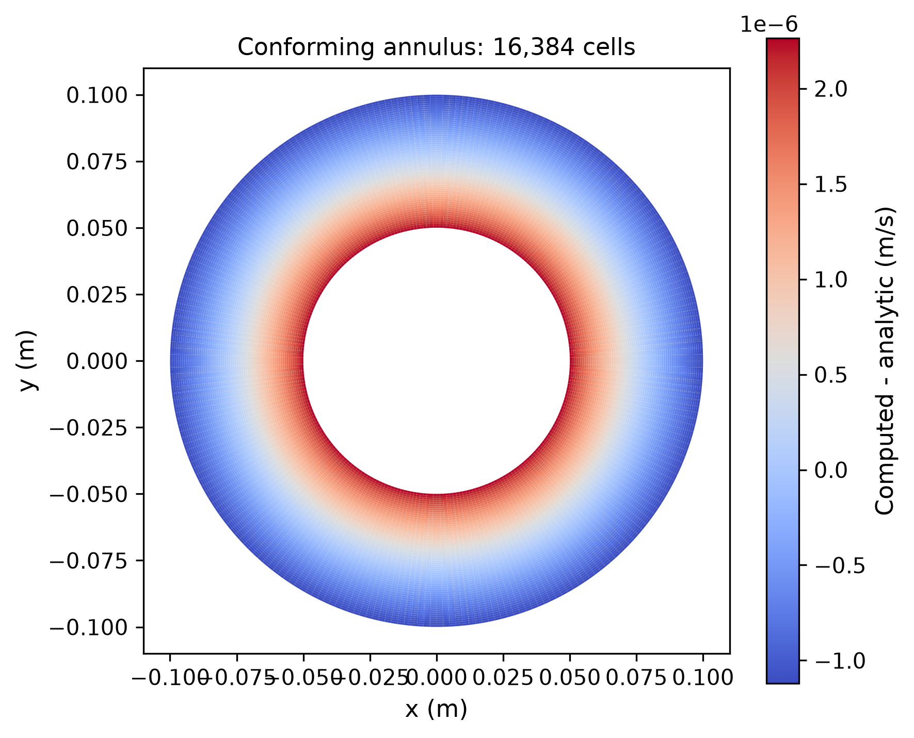
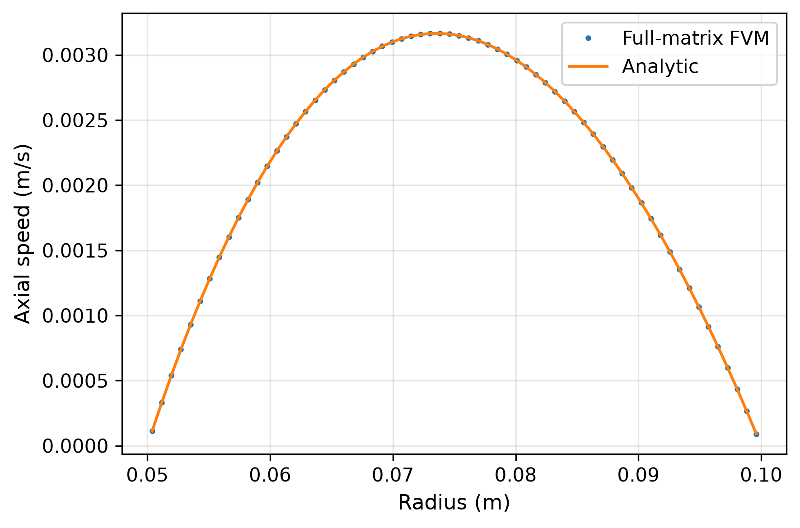
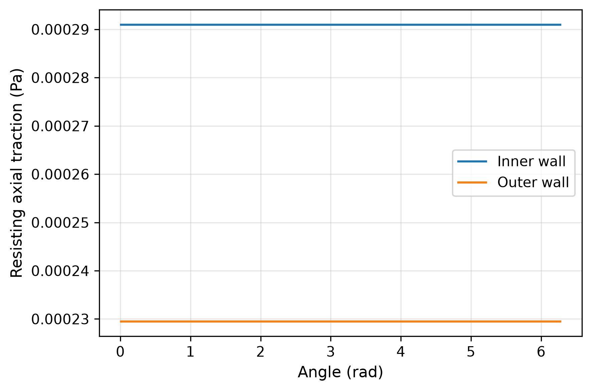
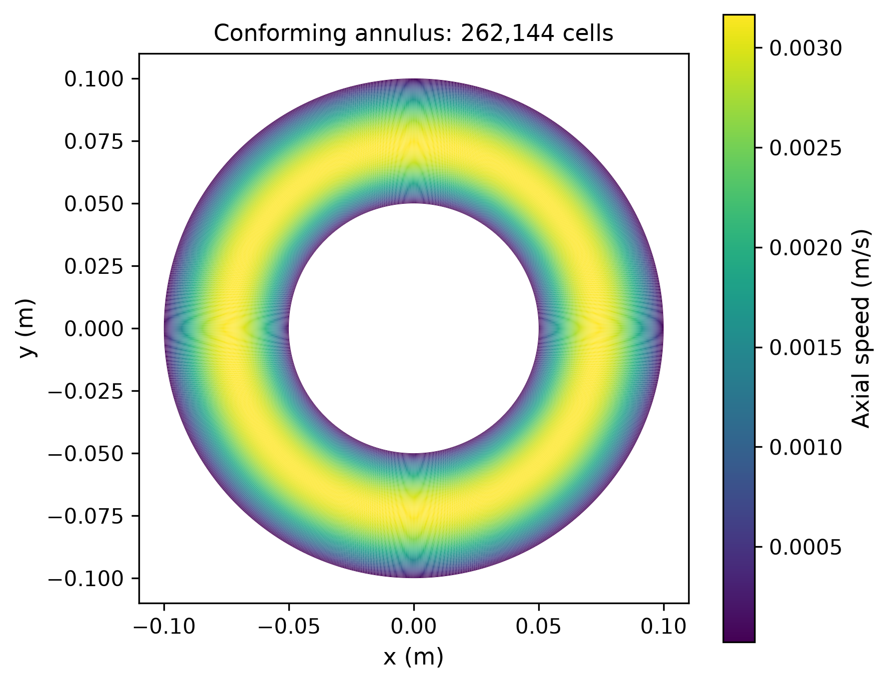
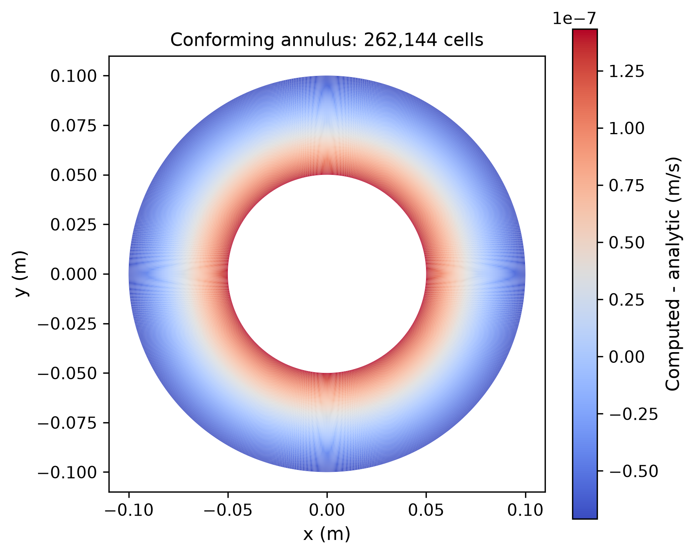
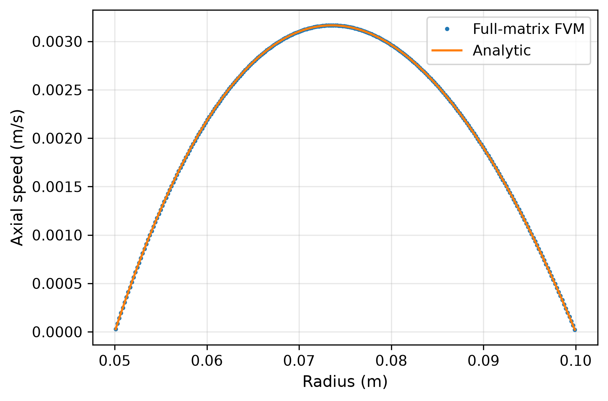
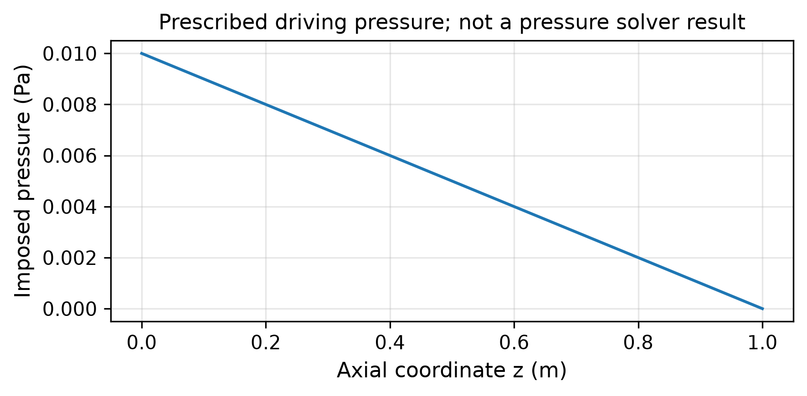
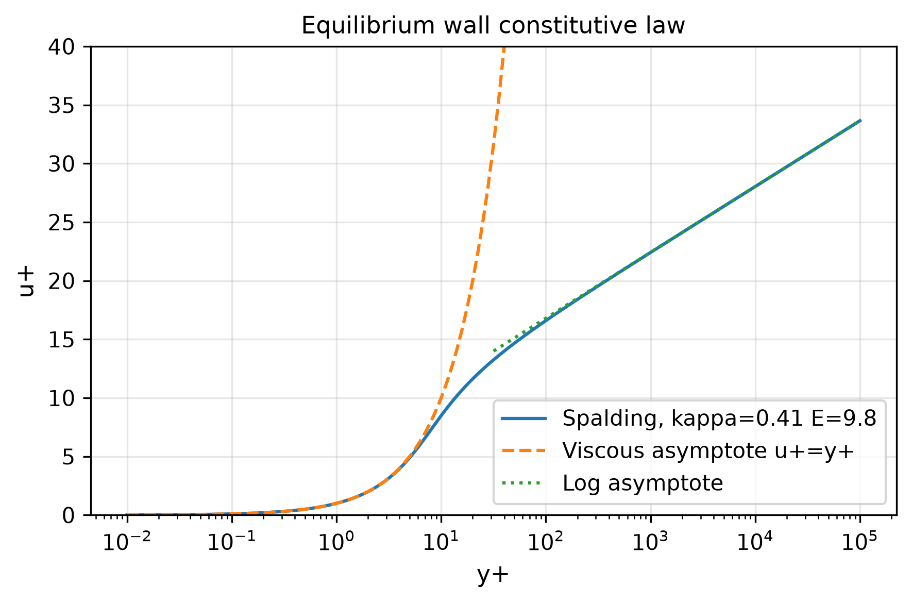

# 大规模贴体环形管与壁面函数基础验证

## 1. 问题、方程与适用范围

同心环形管内的稳态、不可压、充分发展轴向层流。Ri=0.05 m，Ro=0.1 m，μ=0.001 Pa·s，ρ=1 kg/m³，G=−dp/dz=0.01 Pa/m，内外壁无滑移。
由于 w=w(x,y)、横向速度为零，完整三维 NS 精确约化为 −div(μ grad w)=G；不是一般三维入口、弯管、涡脱落或压力投影验证。
解析解 w=G/(4μ)[Ro²−r²−K ln(Ro/r)]，K=(Ro²−Ri²)/ln(Ro/Ri)。可直接对径向 Laplace 算子微分验证，边界为零。
Q=πG/(8μ)[Ro⁴−Ri⁴−(Ro²−Ri²)²/ln(Ro/Ri)]。
内/外壁的阻力（单位轴长）分别是 πG(K−2Ri²)/2 和 πG(2Ro²−K)/2，总和为Gπ(Ro²−Ri²)。

## 2. 软件使用、网格与真实求解

注册新的 AnnularMesh 到现有 Mesh2D/backend 契约，内外圆以贴体多边形表示，周向接缝完全共享面。
标量轴向黏性算子实际调用生产 BodyFittedSolver._momentum/_gradient/_matvec，壁面零速度；没有执行其二维横向对流/压力修正。
全部角向和径向未知数显式组装成完整 CSR 矩阵，SciPy CG/Jacobi 求解，零初值；没有解析初始化、径向平均或事后修正。
解析值只用于误差比较。压力是外加驱动 p(z)=G(1−z)，压力图明确标注为规定值，不冒充数值压力解。

~~~bash
uv pip install --python /path/to/python scipy matplotlib
OMP_NUM_THREADS=1 MKL_NUM_THREADS=1 PYTHONPATH=src python -m tensorfvm.verification.engineering --output results/engineering
~~~

## 3. 误差验收与计算结果

物理指标分别严格 <3%：体积加权速度L2、速度L∞、流量、内外壁力和圆环面积；另要求全局动量力平衡 <1e−9、真实离散残差 <2e−10。
从每个面的几何、实际速度和系数独立重建通量，检查每个CV的几何闭合、整个矩阵未知数数量、圆壁力与流量。
三个正式网格为 256×64、512×128、1024×256，16,384 / 65,536 / 262,144 个单元。

| 网格 | 单元/未知数 | 速度L2误差 | 流量误差 | 内壁力误差 | 真实线性残差 | 通过 |
|---|---:|---:|---:|---:|---:|---|
| 256x64 | 16,384 | 0.042030% | 0.026437% | 0.017925% | 3.013e-11 | True |
| 512x128 | 65,536 | 0.010510% | 0.006612% | 0.004482% | 4.551e-10 | False |
| 1024x256 | 262,144 | 0.002628% | 0.001653% | 0.001120% | 7.508e-09 | False |

速度空间观察阶：[1.9996839625365963, 1.9999210067845663]；正式资格：False。

## 4. 贴体几何优势与比较边界

报告另计算相同圆环的笛卡尔阶梯 mask 面积和边界长度。
这是几何比较，没有运行对应 LBM/FVM 流场，也不代表采用曲面插值或 immersed-boundary 的 LBM 能力。
贴体网格直接输出物理壁面法向、长度、剪切与积分力，避免将阶梯面长当圆周长。
不能由该几何测试推论流体误差、GPU速度、峰值内存或一般工业优势。

| 笛卡尔背景网格 | 流体格点数 | 面积误差 | 阶梯周长误差 |
|---|---:|---:|---:|
| 128² | 9664 | 0.134985% | 27.323954% |
| 256² | 38576 | 0.072248% | 27.323954% |
| 512² | 154424 | 0.005464% | 27.323954% |

## 5. Spalding 壁面函数

实现 y+=u++[exp(κu+)−1−κu+−(κu+)²/2−(κu+)³/6]/E，κ=0.41、E=9.8。
给定壁面相对切向速度、距离和SI黏度，反解uτ并返回流体侧阻力τ=−ρuτ² Urel/|Urel|。
包含零速、黏性区、小参数的数值稳定处理、缓冲区、对数区及负功检查。
本轮以141个y+样本作构成关系反解验证，独立SciPy标量root重建；不是141个CFD算例。
这验证了可复用壁面本构模块，尚未接入原有SA输运边界；不能把它称作SA壁面函数计算已经通过。
数学测试延伸到大y+只验证反解，不证明外层/分离流中壁面模型有效。

参考公式：[OpenFOAM 原生产 Spalding 壁面函数](https://github.com/OpenFOAM/OpenFOAM-dev/blob/master/src/MomentumTransportModels/momentumTransportModels/derivedFvPatchFields/wallFunctions/nutWallFunctions/nutUSpaldingWallFunction/nutUSpaldingWallFunctionFvPatchScalarField.C)。
湍流验证资料：[NASA TMR 迁移说明](https://www.nasa.gov/nasa-turbulence-modeling-resource/)、[当前 SA 模型定义](https://tmbwg.github.io/turbmodels/spalart.html)、[平板验证](https://tmbwg.github.io/turbmodels/flatplate_val.html)。

## 6. 由易到难的下一阶段

1. 本轮：大规模曲壁黏性问题与壁面本构模块；保留适用范围。
2. SA贴壁平板：公开匹配工况和剖面/Cf数据，首层y+、残差与三网格共同验收；原20%门不升级成3%资格。
3. 真正壁面函数RANS：SA/其他闭合的壁面边界需一致耦合，比较y+约1与30–100、同误差计算成本。
4. 翼型压力梯度/分离及曲壁湍流：再做NACA/后向台阶/弯管与实验数据比较，最后才是SUBOFF工程流动。

本发布包含完整原场、全矩阵实际迭代数、误差表、曲线CSV、300dpi PNG/PDF/SVG、源码哈希与独立审计。研究稿尚未同行评审。

## 256x64 原场图版

## 1024x256 原场图版

