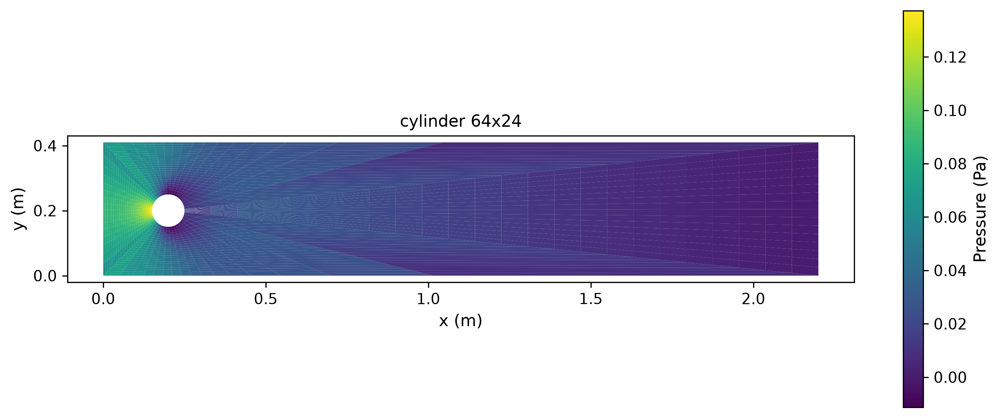
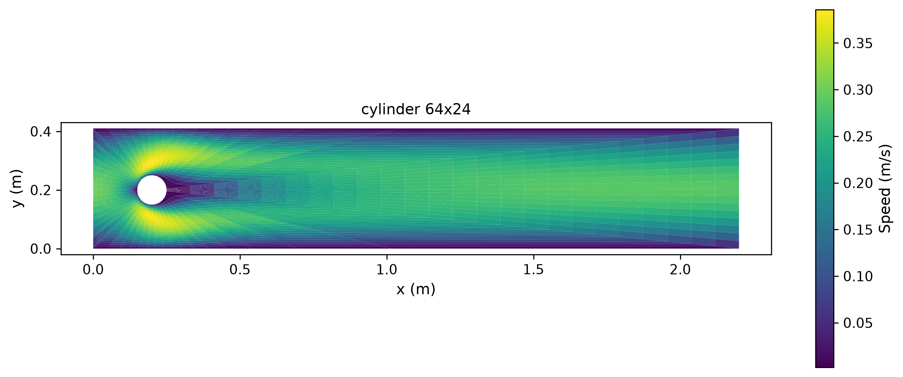
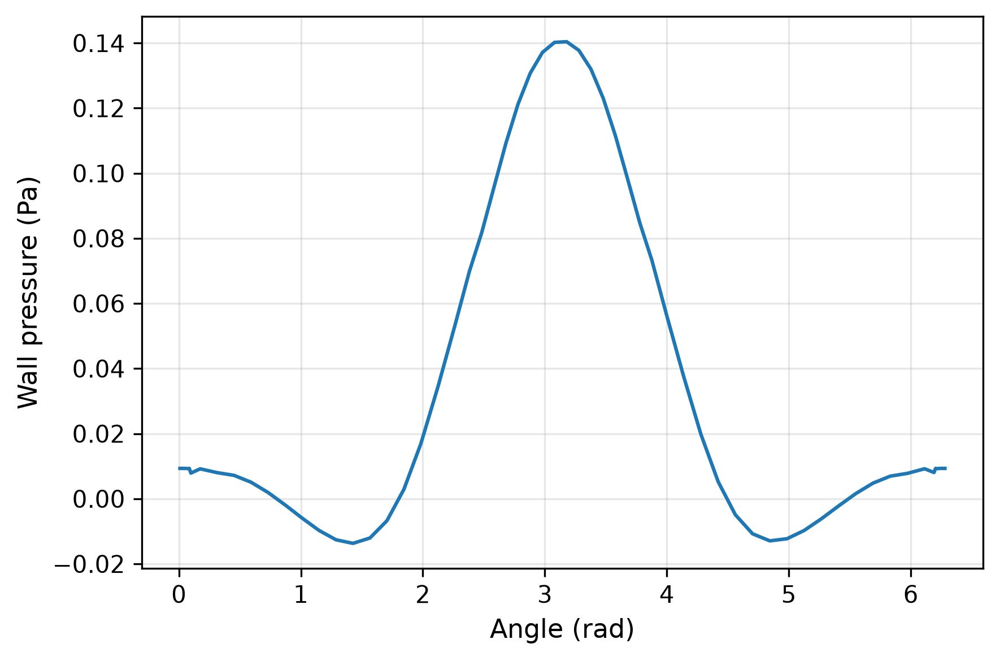

# 圆柱与 NACA0012 贴体有限体积 benchmark

## 问题、算法与验收

圆柱采用 DFG 2D-1，Re=20，通道2.2×0.41 m、直径0.1 m、平均入口0.2 m/s、抛物线入口。参考来源：[FeatFlow](https://wwwold.mathematik.tu-dortmund.de/~featflow/en/benchmarks/cfdbenchmarking/flow/dfg_benchmark1_re20.html)。翼型采用 NACA0012、Re=1000、攻角4°、单位弦长、20×16计算域、翼型前缘(6,8)。参考来源：[Di Ilio 2020](https://arxiv.org/html/2006.10487)，图10/11 present study。

原生贴体 SIMPLE、Rhie–Chow、一次迎风对流、非正交扩散，CPU使用SciPy SuperLU稀疏直接解，CUDA使用Torch Krylov；两者只加速相同线性方程，并检查真实线性残差。名为 c-grid 的翼型网格实际为周期径向拓扑。圆柱 Cd、Cl、前后压力差及翼型 Cd、Cl 分别严格小于3%，同时满足实际稳态残差。保存完整原始场、面通量、分项牵引、历史与源文件哈希。

## 参考值修正

旧翼型0.205/0.120图上估读不能支撑严格3%验收。本轮从矢量路径读出4°处坐标：Cl=27.41/190.95×1.4，Cd=23.87/190.95，各±0.0001图形读取区间。使用两端点最坏相对误差；此区间不包含作者数值方法误差。旧报告保留为历史记录，其通过结论撤回。4°没有匹配的公开Cp表，因此Cp曲线仅作计算结果展示。

## 软件使用

```bash
OMP_NUM_THREADS=1 MKL_NUM_THREADS=1 PYTHONPATH=src python -m tensorfvm.verification.external_flow --output results/external --case cylinder --grids 64x24 128x48 256x96
# 翼型: --case naca --grids 64x26 128x52 256x104
# --device cuda 为相同方程的 GPU 计算，单次耗时不是重复性能测量
```

## 计算结果

|案例|网格|设备|迭代/收敛|Cd|Cl|最大物理误差|全部通过|
|---|---|---|---|---|---|---|---|
|cylinder|64x24|cpu|975/True|6.3247924|0.015101732|42.2150%|False|

## 验证范围

独立审计重新积分压力及黏性牵引，检查壁面无滑移和质量通量，重算严格参考验收；未独立重跑全部离散方程。网格增加并不自动证明渐近收敛。未执行匹配 LBM 计算时不作性能或精度优劣排名。本轮为二维稳态层流；高Re尾涡、湍流及三维流动需要额外验证。






