# Body-fitted finite-volume DFG 2D-1 cylinder verification

## Problem and reference

DFG 2D-1: steady incompressible laminar flow, Re=20, channel 2.2 by 0.41 m, cylinder center (0.2,0.2) m and radius 0.05 m. The mean inlet speed is 0.2 m/s, density 1 kg/m3 and dynamic viscosity 0.001 Pa s. No-slip applies to the cylinder and channel walls. The inlet parabolic velocity is integrated exactly over each physical face; outlet pressure is zero with zero-gradient velocity. Drag, lift and front/rear pressure difference are compared with the [FeatFlow reference](https://wwwold.mathematik.tu-dortmund.de/~featflow/en/benchmarks/cfdbenchmarking/flow/dfg_benchmark1_re20.html).

## Mesh and discretization

Gmsh 4.15.2 frontal Delaunay generates conforming triangles with physical boundary tags; cylinder CAD arcs or a closed NACA0012 interpolating spline define the body. Physical wall faces are linear chords. See the [Gmsh official manual](https://gmsh.info/doc/texinfo/gmsh.html) for algorithm 6 and Distance/Threshold fields. Neither Cartesian obstacle masks nor staircase boundaries are used. Positive volumes and projected face distances and a maximum nonorthogonality below 70 degrees are required before solving. The 70-degree project gate is a screening criterion, not proof of sufficient accuracy.

The recorded discretization is `{"face_interpolation": "arithmetic", "momentum_convection": "upwind", "pressure_gradient": "least-squares", "wall_gradient": "displacement-correction"}`. Linear upwind uses the least-squares gradient of the upstream cell and the actual face-to-cell displacement; its conservative deferred correction is inspired by [OpenFOAM linearUpwind](https://github.com/OpenFOAM/OpenFOAM-dev/blob/master/src/finiteVolume/interpolation/surfaceInterpolation/schemes/linearUpwind/linearUpwind.C). This is unlimited reconstruction, so no bounded/TVD claim is made. Gauss pressure gradients use geometric face interpolation and the same boundary face pressure used by pressure traction. Nonorthogonal diffusion, physical Rhie-Chow flux and no-slip reconstructed molecular stress are retained. Cylinder acceleration uses a full-grid coupled Picard matrix with an independent response check; NACA uses SIMPLE and Anderson mixing. CPU sparse solves check true residuals. No reference value enters the equations, initialization or relaxation.

## Reproduction and acceptance

```bash
uv pip install --python /path/to/python gmsh numpy scipy matplotlib
OMP_NUM_THREADS=1 OPENBLAS_NUM_THREADS=1 PYTHONPATH=src python -m tensorfvm.verification.external_gmsh --case cylinder --scales 1.0 1.0 1.0 --solver upwind --max-iterations 300 --output results/cylinder
PYTHONPATH=src python scripts/audit_external_equations.py results/cylinder
PYTHONPATH=src python -m tensorfvm.verification.external_mesh_report results/cylinder
```

Raw mesh/field files, velocity/pressure arrays, face mass fluxes, separate tractions, full histories, linear residuals and SHA256 source/artifact manifests accompany this report. Each physical relative error must be strictly below 3%; steady equation residuals must be below 1e-6 and the physical flux fixed-point defect below 1e-7. Source-preserving independent NumPy replay checks full configured equations. Three runs do not establish an asymptotic grid regime; qualification of the finest run does not qualify the entire refinement sequence. GPU and matched TensorLBM runs have not been performed for this new unstructured path.

## Results

|Method|Mesh scale|Actual cells|Max nonorthogonality (deg)|Iterations|Steady|Cd|Cl|Maximum physical error|Run accepted|
|---|---:|---:|---:|---:|---|---:|---:|---:|---|
|upwind|1|8252|21.595|33|True|5.79708501|0.0484330135|356.0999%|False|
|linear-upwind|1|8252|21.595|34|True|5.51625733|0.0233518549|119.9074%|False|
|conservative-linear-upwind|1|8252|21.595|35|True|5.54301346|0.0100601062|5.2627%|False|

Per-metric errors and all reference intervals are in `summary.json`; independent replay is in `equations-audit.json`.


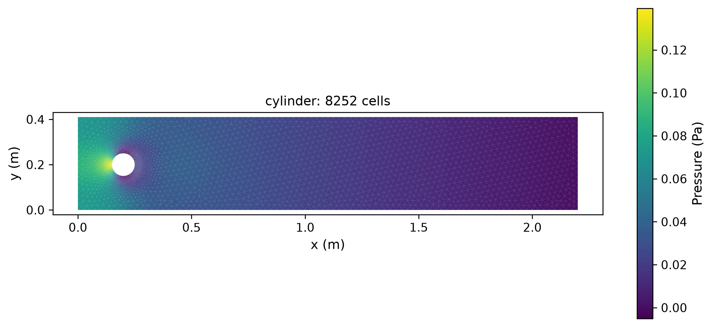

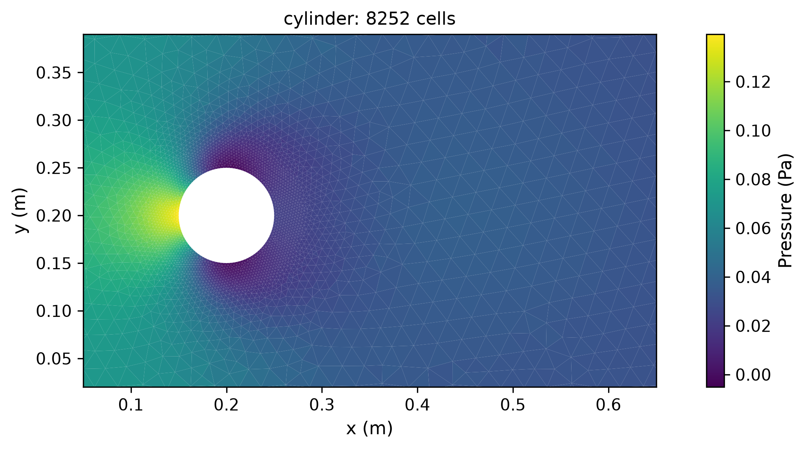

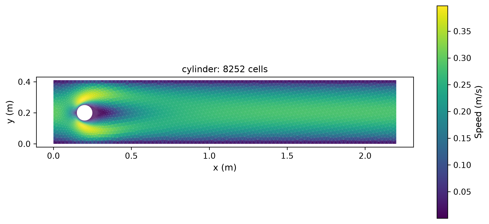

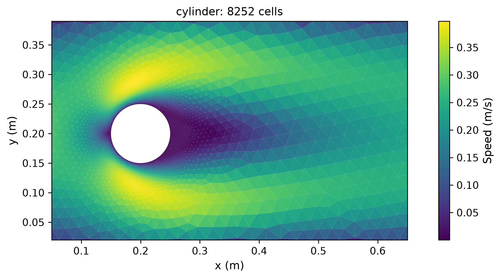

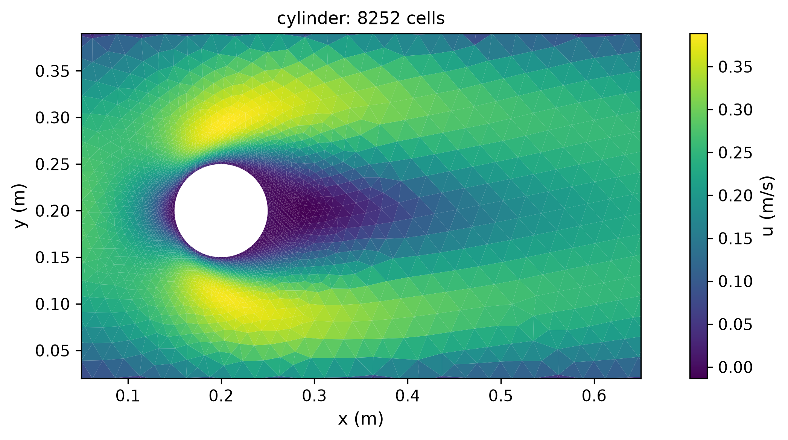

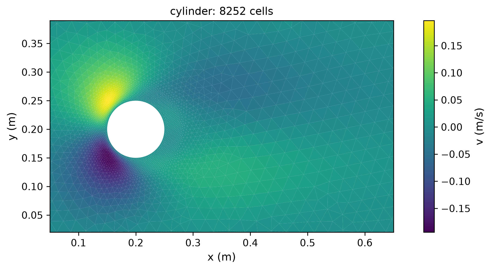


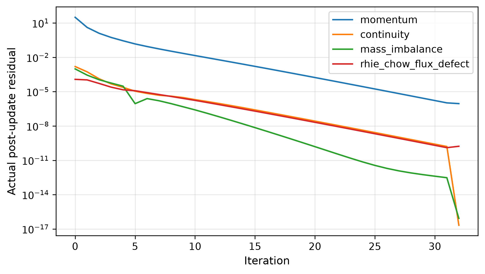

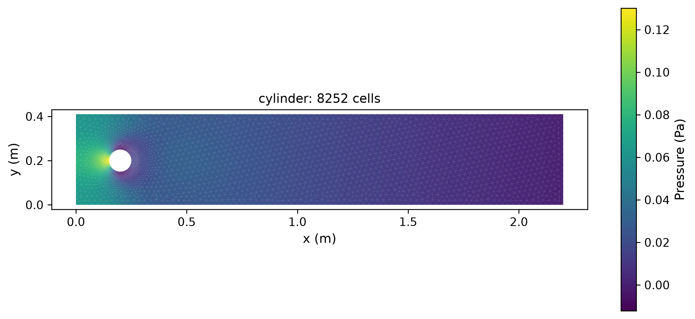

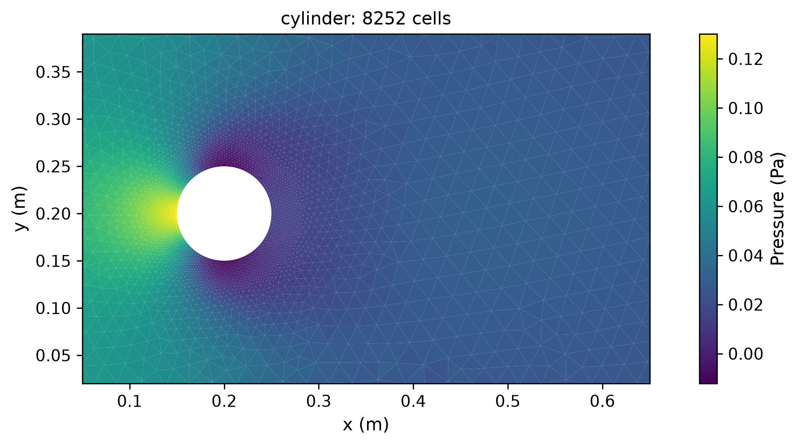

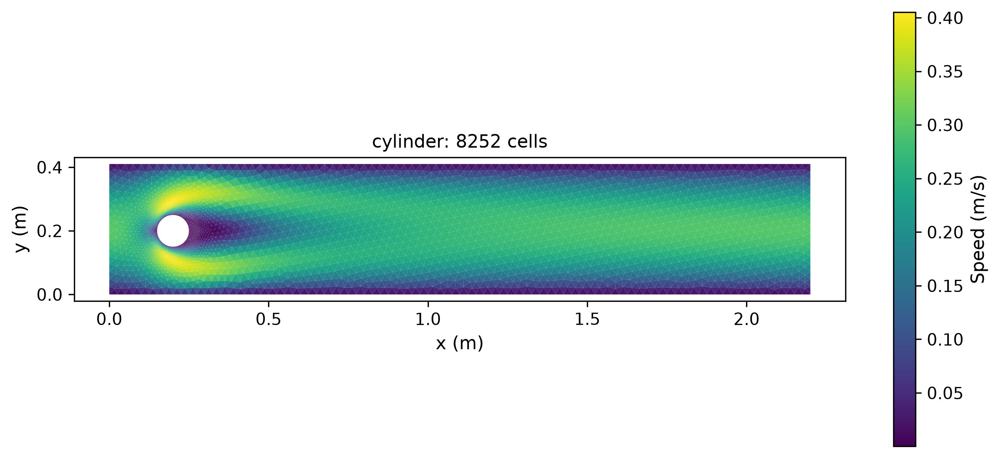

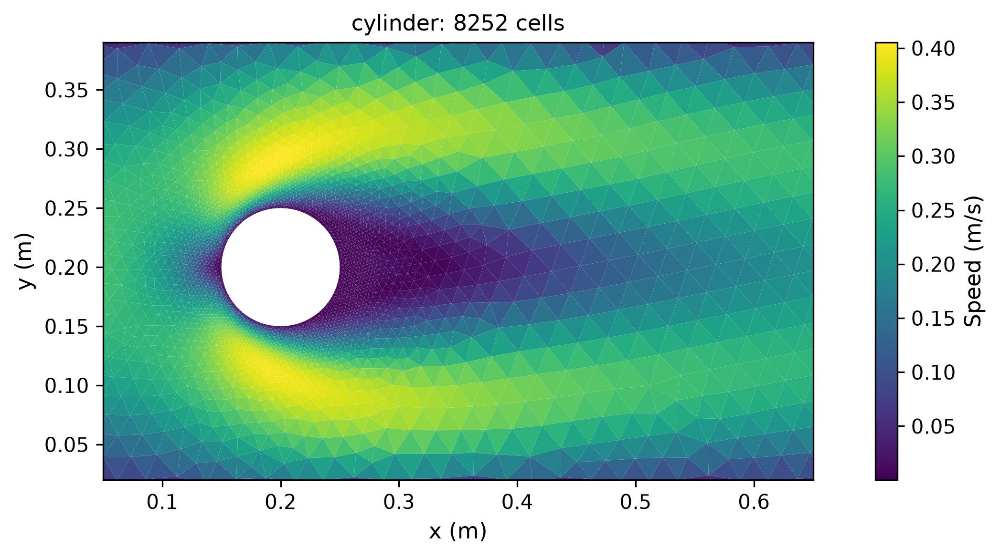


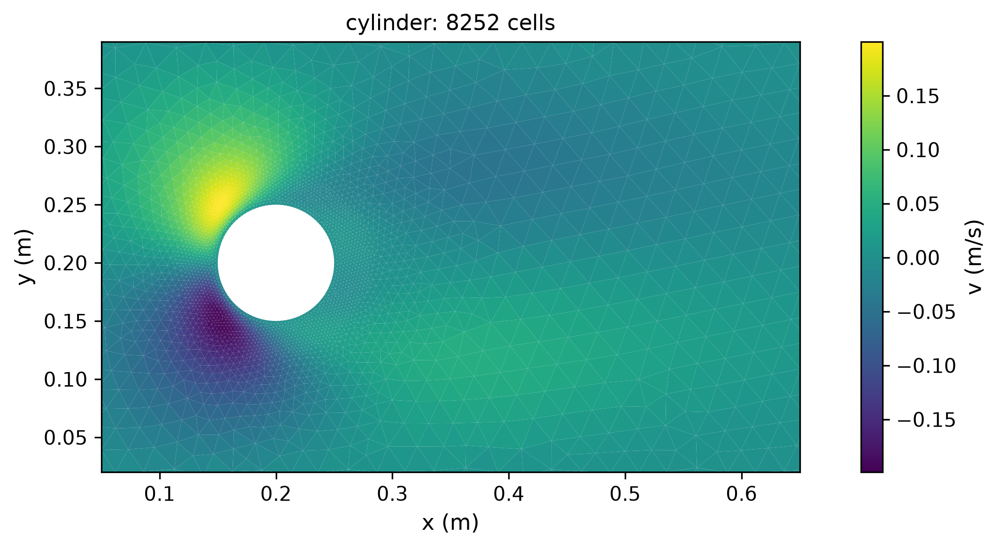


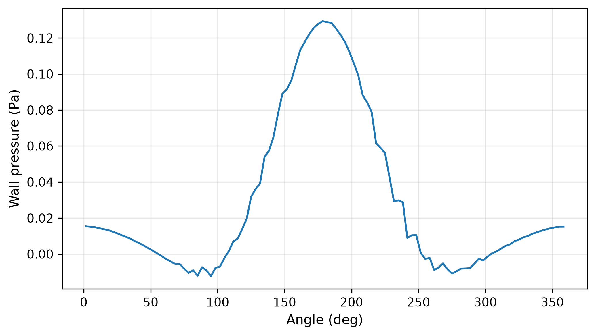

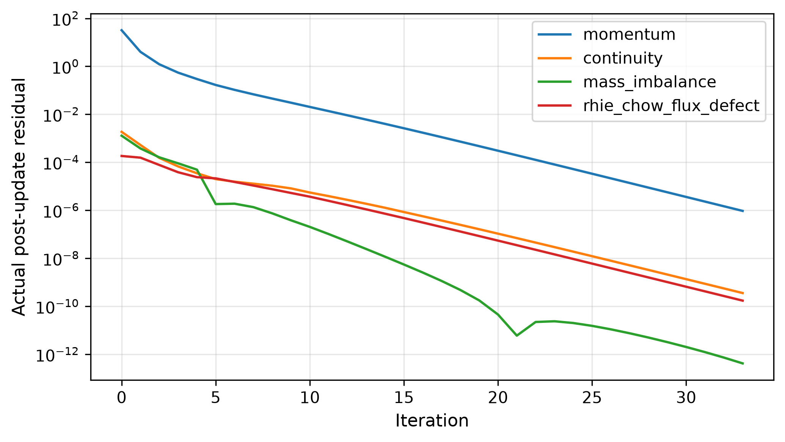


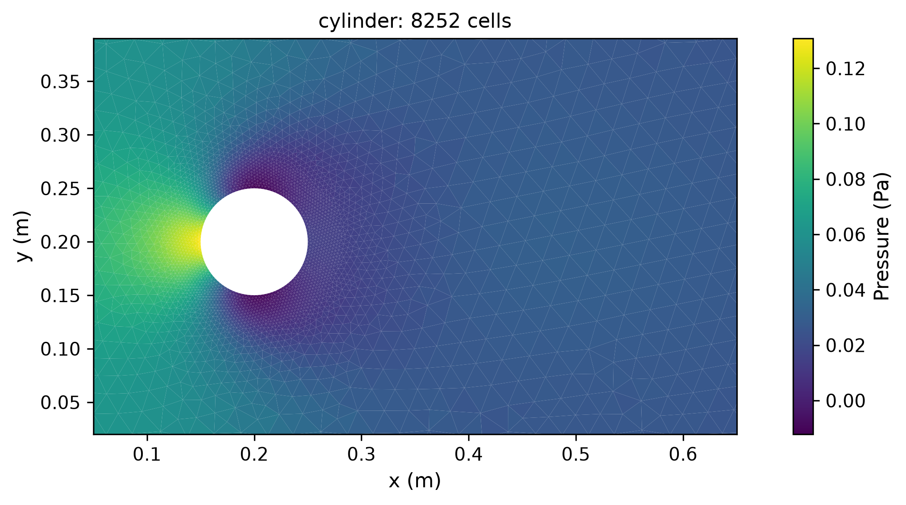


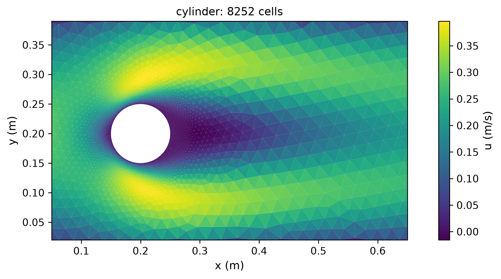


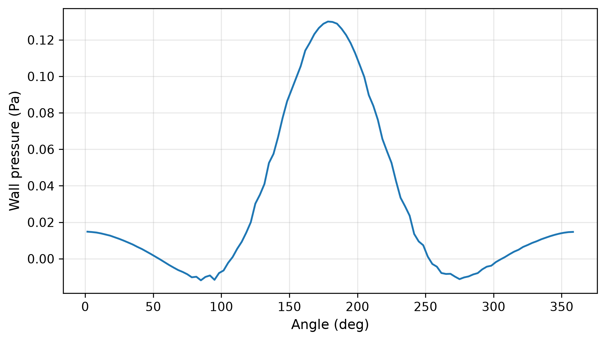

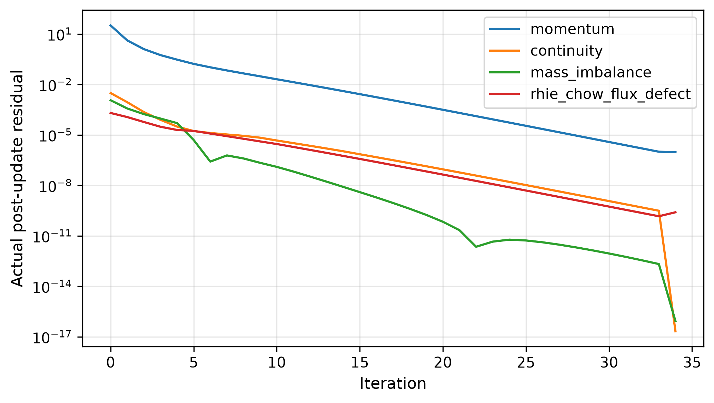

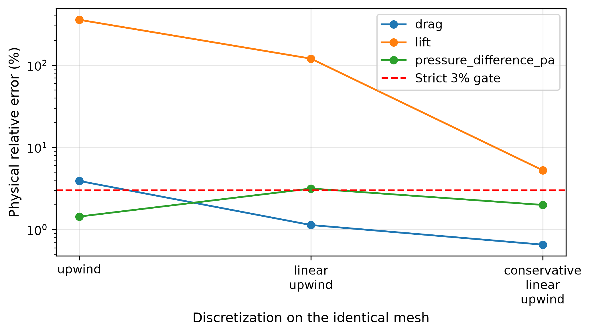

## Discussion

Mesh validity, mesh quality, equation convergence and reference accuracy are reported separately. The refined physical coefficients and successive changes above determine the next development step; no failed case is relabeled as qualified. Wall geometry consists of linear chords, and viscous traction is reconstructed from no-slip data. Pressure-gradient and transport changes require full equation replay, not just a lower internal residual. The original radial-grid studies and their failures remain archived for comparison.
