# Body-fitted finite-volume NACA0012 verification

## Problem and reference

Steady incompressible laminar NACA0012 flow at Re=1000 and incidence 4 degrees, unit chord, domain 20 by 16 m and leading edge (6,8) m. The freestream vector is (cos(4 deg),sin(4 deg)) m/s. The body is no-slip; prescribed velocity is applied at the inlet and top/bottom far-field boundaries, and outlet pressure is zero. Drag/lift use aerodynamic axes. Comparisons use vector-digitized present-study markers in [Di Ilio et al. (2020), figures 10 and 11](https://arxiv.org/html/2006.10487), with +/-0.0001 graph-reading intervals and worst endpoint relative errors. The paper specifies open top/bottom boundaries, whereas this diagnostic retains prescribed freestream there. The paper also uses a 36C by 16C domain and places the quarter-chord point 12C from the inlet. Both boundary and domain differences must be resolved before claiming a matched reference benchmark. No matched 4-degree tabulated Cp reference is available.

## Mesh and discretization

Gmsh 4.15.2 frontal Delaunay generates conforming triangles with physical boundary tags; cylinder CAD arcs or a closed NACA0012 interpolating spline define the body. Physical wall faces are linear chords. See the [Gmsh official manual](https://gmsh.info/doc/texinfo/gmsh.html) for algorithm 6 and Distance/Threshold fields. Neither Cartesian obstacle masks nor staircase boundaries are used. Positive volumes and projected face distances and a maximum nonorthogonality below 70 degrees are required before solving. The 70-degree project gate is a screening criterion, not proof of sufficient accuracy.

The recorded discretization is `{"face_interpolation": "projected-linear", "momentum_convection": "linear-upwind", "pressure_gradient": "gauss-linear", "wall_gradient": "displacement-correction"}`. Linear upwind uses the least-squares gradient of the upstream cell and the actual face-to-cell displacement; its conservative deferred correction is inspired by [OpenFOAM linearUpwind](https://github.com/OpenFOAM/OpenFOAM-dev/blob/master/src/finiteVolume/interpolation/surfaceInterpolation/schemes/linearUpwind/linearUpwind.C). This is unlimited reconstruction, so no bounded/TVD claim is made. Gauss pressure gradients use geometric face interpolation and the same boundary face pressure used by pressure traction. Nonorthogonal diffusion, physical Rhie-Chow flux and no-slip reconstructed molecular stress are retained. Cylinder acceleration uses a full-grid coupled Picard matrix with an independent response check; NACA uses SIMPLE and Anderson mixing. CPU sparse solves check true residuals. No reference value enters the equations, initialization or relaxation.

## Reproduction and acceptance

```bash
uv pip install --python /path/to/python gmsh numpy scipy matplotlib
OMP_NUM_THREADS=1 OPENBLAS_NUM_THREADS=1 PYTHONPATH=src python -m tensorfvm.verification.external_gmsh --case naca --scales 2.0 1.0 --solver conservative-linear-upwind --max-iterations 1800 --output results/naca
PYTHONPATH=src python scripts/audit_external_equations.py results/naca
PYTHONPATH=src python -m tensorfvm.verification.external_mesh_report results/naca
```

Raw mesh/field files, velocity/pressure arrays, face mass fluxes, separate tractions, full histories, linear residuals and SHA256 source/artifact manifests accompany this report. Each physical relative error must be strictly below 3%; steady equation residuals must be below 1e-6 and the physical flux fixed-point defect below 1e-7. Source-preserving independent NumPy replay checks full configured equations. Three runs do not establish an asymptotic grid regime; qualification of the finest run does not qualify the entire refinement sequence. GPU and matched TensorLBM runs have not been performed for this new unstructured path.

## Results

|Method|Mesh scale|Actual cells|Max nonorthogonality (deg)|Iterations|Steady|Cd|Cl|Maximum physical error|Run accepted|
|---|---:|---:|---:|---:|---|---:|---:|---:|---|
|conservative-linear-upwind|2|3934|23.465|560|True|0.127569525|0.232070235|15.5362%|False|
|conservative-linear-upwind|1|15018|25.851|1454|True|0.127141246|0.216320534|7.6952%|False|

Per-metric errors and all reference intervals are in `summary.json`; independent replay is in `equations-audit.json`.


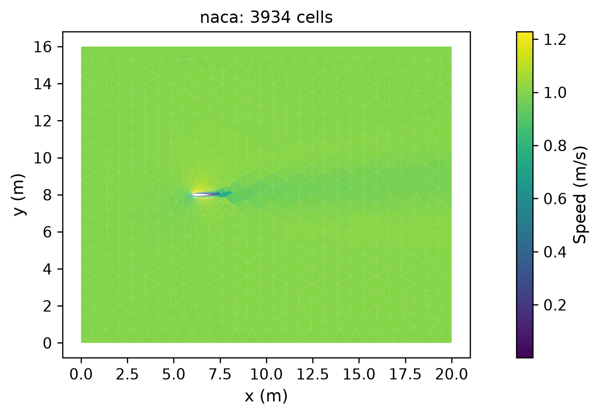


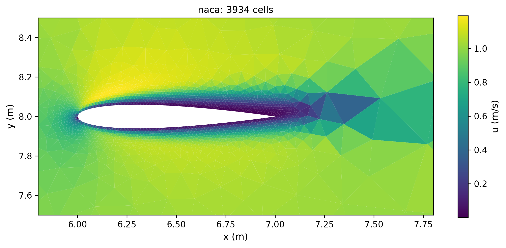

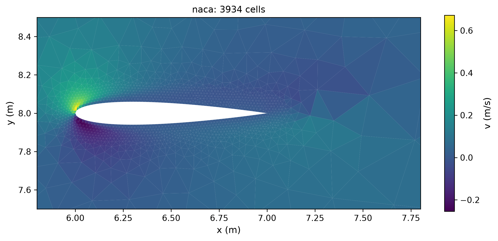

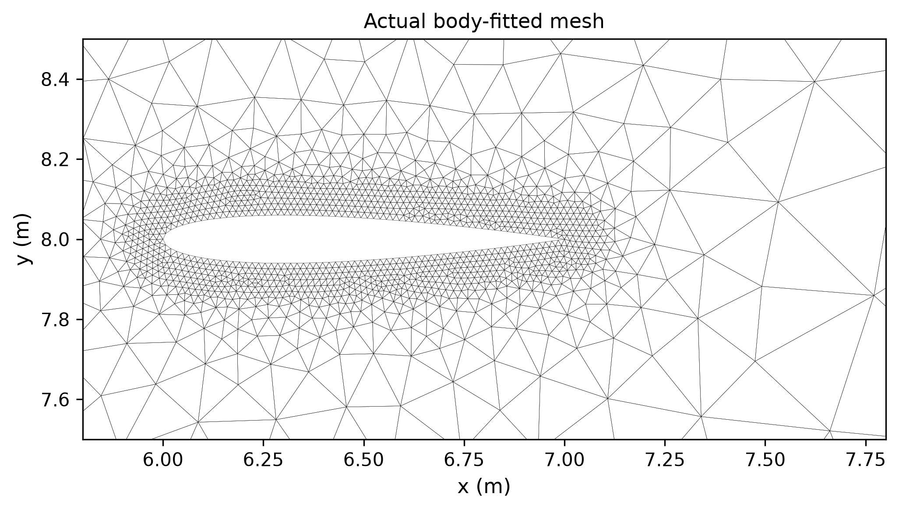

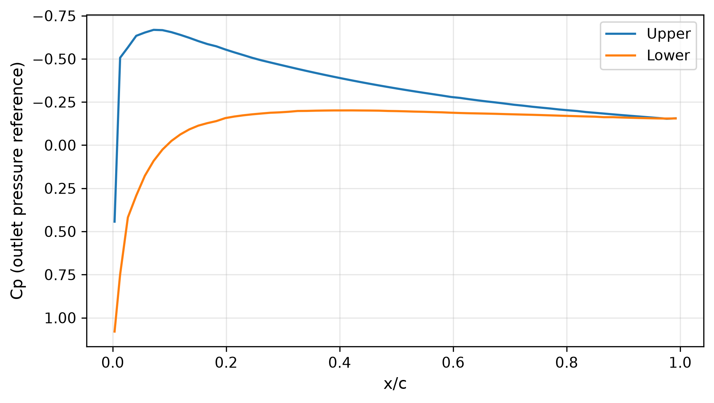

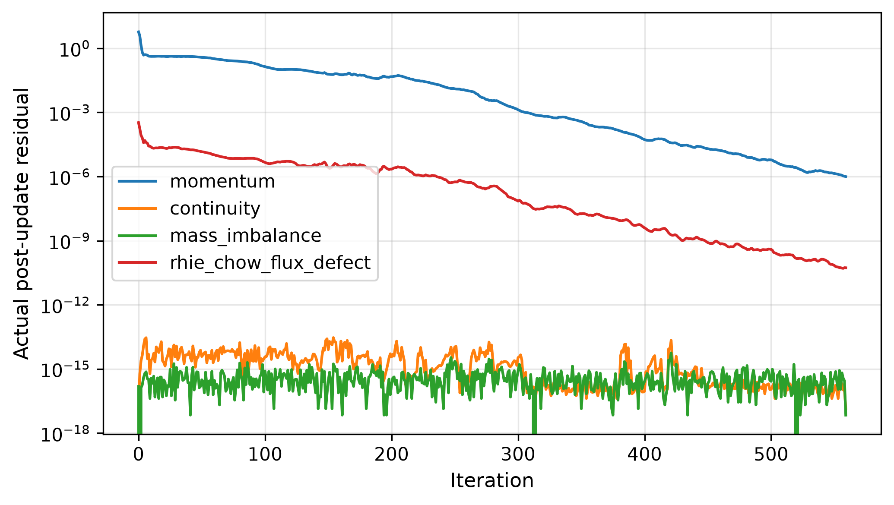

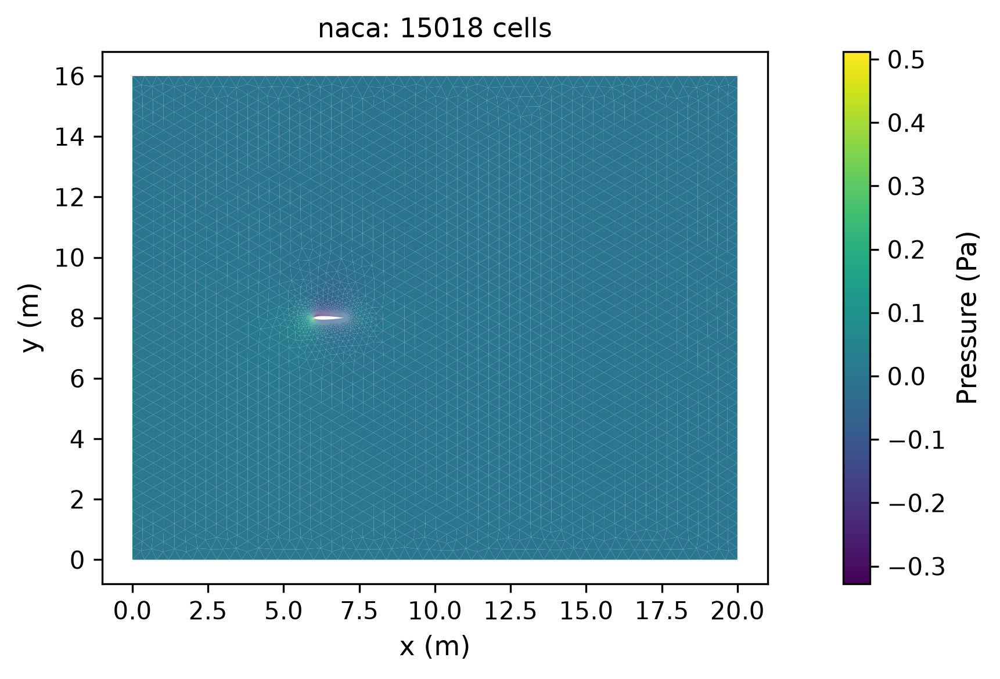

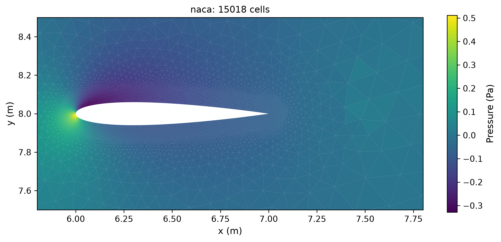

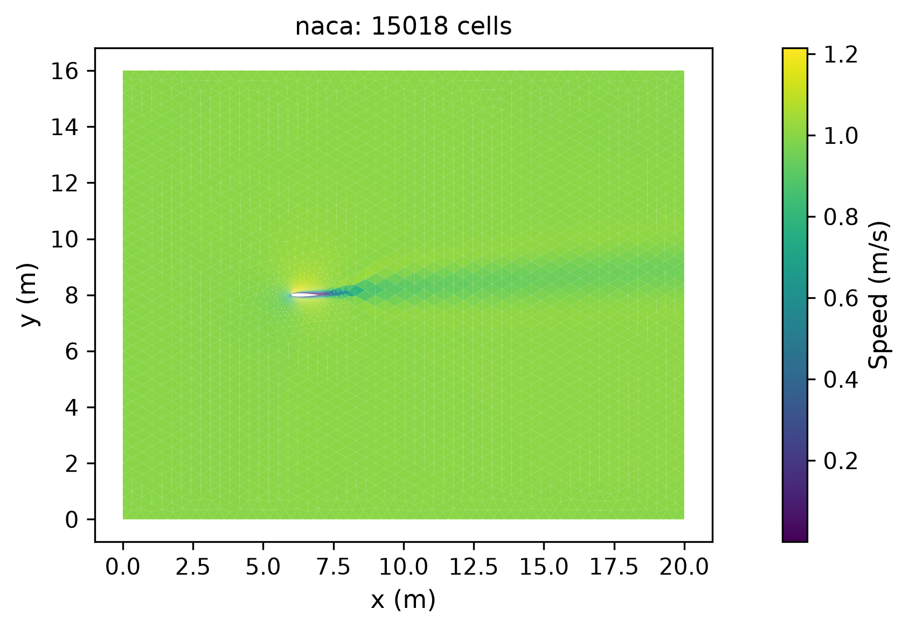

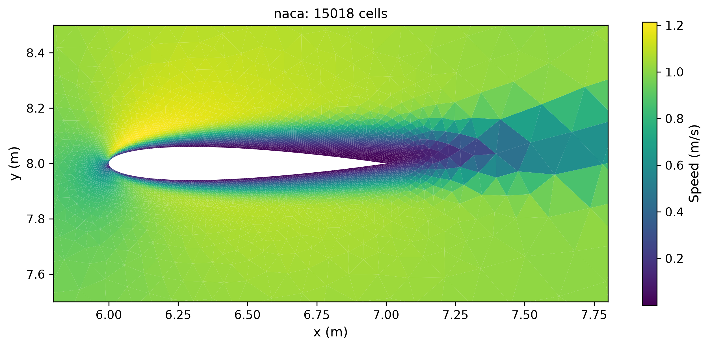

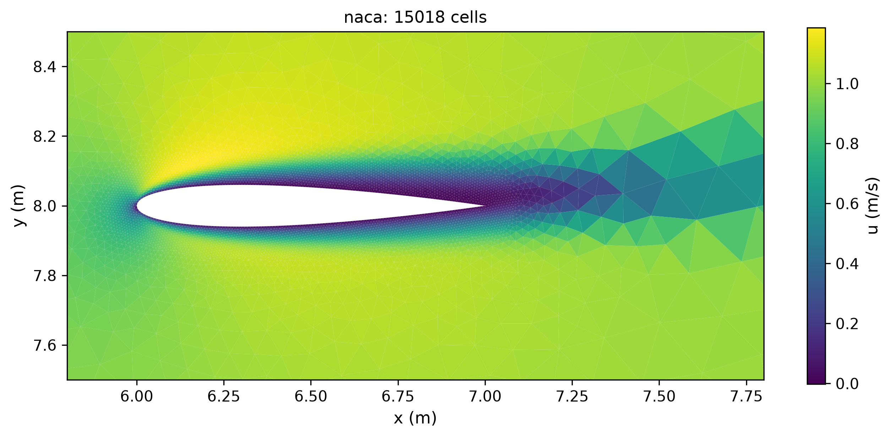

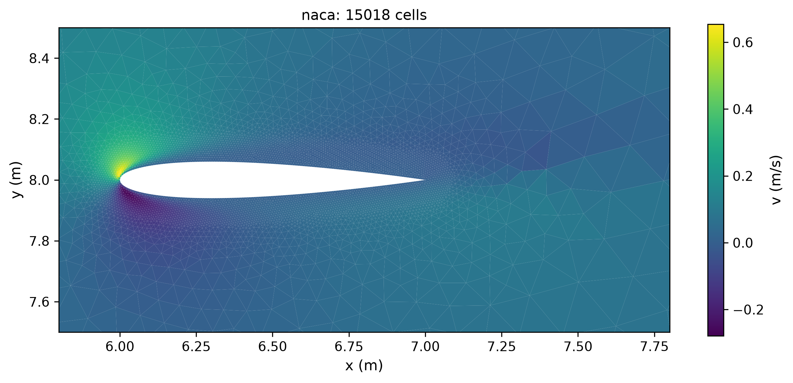

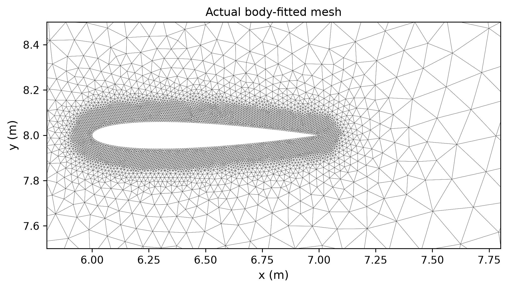

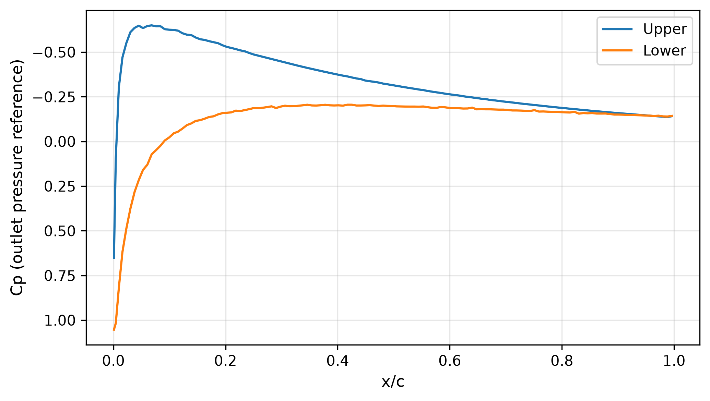

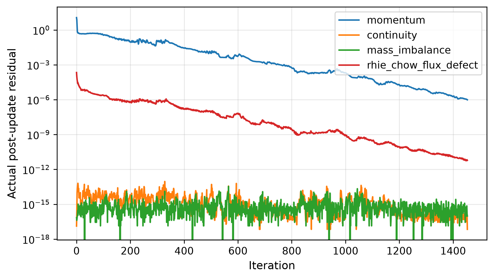

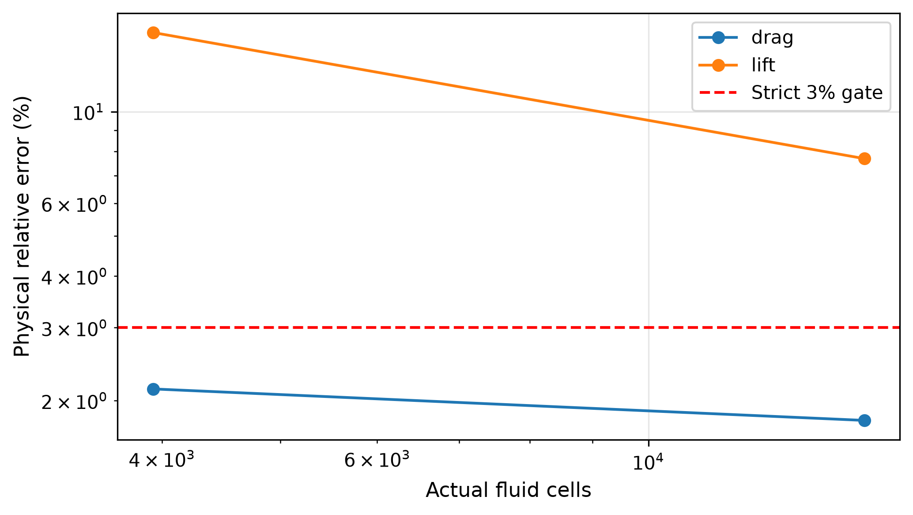

## Discussion

Mesh validity, mesh quality, equation convergence and reference accuracy are reported separately. The refined physical coefficients and successive changes above determine the next development step; no failed case is relabeled as qualified. Wall geometry consists of linear chords, and viscous traction is reconstructed from no-slip data. Pressure-gradient and transport changes require full equation replay, not just a lower internal residual. The original radial-grid studies and their failures remain archived for comparison.
