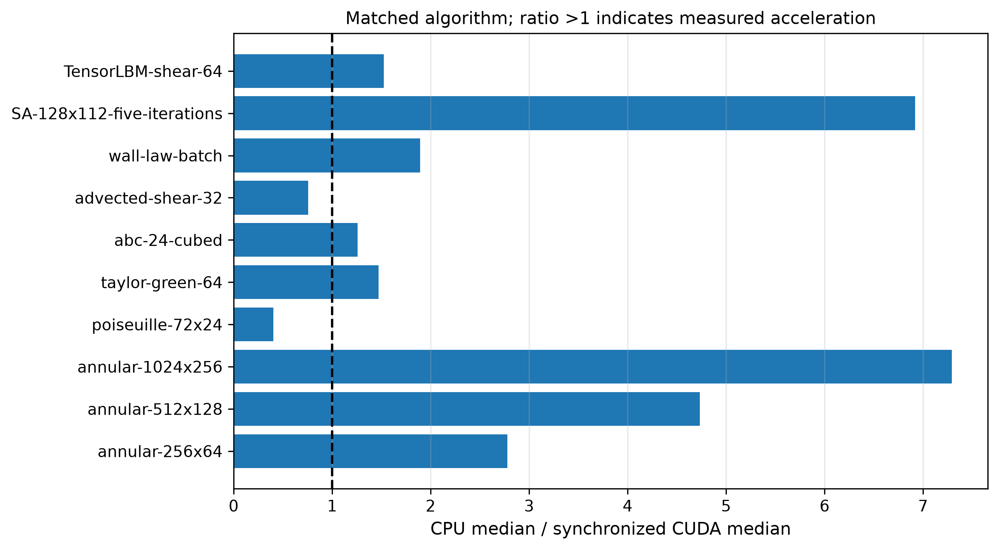

# CPU / CUDA 实际求解与加速验证

## 方法

硬件：NVIDIA GeForce RTX 3090，float64，CPU单线程。每个案例先完整warm-up，再分别重复3次，CUDA前后同步，报告中位数。计时含设置、求解、诊断及原场主机导出，不含绘图。两种硬件使用同一算法和参数；环形管统一使用torch CSR/Jacobi CG，另有SciPy CPU正式基准。GPU求解器device实际记录为cuda，不作CPU回退。显存为torch峰值allocated，不是整卡/NVIDIA上下文或总系统RSS。

SA项只验证五次生产迭代，不冒充稳态物理benchmark。壁面函数项为65,536个本构反解，不是CFD流场。小网格/float64/同步与导出开销可能使GPU更慢，全部实测结果保留。

| 案例 | CPU中位s | CUDA中位s | CPU/CUDA | CUDA峰值MiB | 数值一致 | 物理通过 |
|---|---:|---:|---:|---:|---|---|
| annular-256x64 | 0.244500 | 0.087992 | 2.779 | 30.22 | True | True |
| annular-512x128 | 1.045079 | 0.220765 | 4.734 | 99.96 | True | True |
| annular-1024x256 | 5.420820 | 0.743379 | 7.292 | 358.08 | True | True |
| poiseuille-72x24 | 5.188505 | 12.872253 | 0.403 | 8.74 | True | True |
| taylor-green-64 | 1.734911 | 1.179258 | 1.471 | 25.25 | True | True |
| abc-24-cubed | 0.636350 | 0.506243 | 1.257 | 21.10 | True | True |
| advected-shear-32 | 1.256918 | 1.661174 | 0.757 | 11.97 | True | True |
| wall-law-batch | 0.727368 | 0.384010 | 1.894 | 17.69 | True | None |
| SA-128x112-five-iterations | 118.809392 | 17.175277 | 6.917 | 29.41 | False | None |
| TensorLBM-shear-64 | 0.230767 | 0.151273 | 1.525 | 9.95 | True | True |

## 原场及限制

每个目录包含CPU/CUDA完整末场与MAC/BGK接受状态、实际history、参数、时间样本及来源。CPU/GPU主字段相对L2差要求≤1e−6；剪切波零参考压力以事先指定动态压力0.745 Pa作RMS尺度，其他零场以1e−14尺度定义绝对差。几何/强制边界和原场独立审计同正式案例。实际加速只适用于本硬件、算法、参数与计时范围，不能推广为所有FVM/湍流/多GPU性能。

## 验收结论

九项通过 CPU/CUDA 场一致性；SA 五次迭代未通过：压力相对 L2 差 0.575%，速度相对 L2 差 1.3344e−6，统一门限 1e−6。整体 correctness_passed=False。SA 时间比 6.917 仅是测量值，不能作为通过正确性认证的加速结果。原场及失败标志完整保留，后续定位压力线性求解停止条件、真实残差与硬件归约敏感性。
