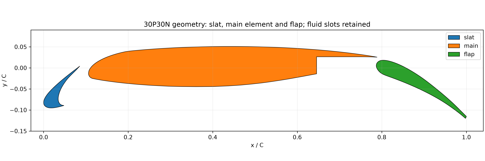
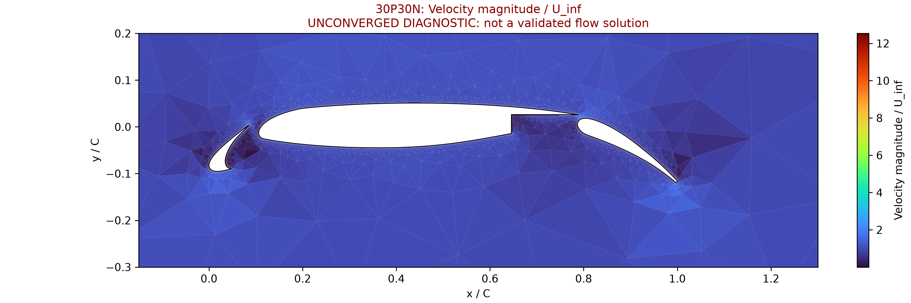
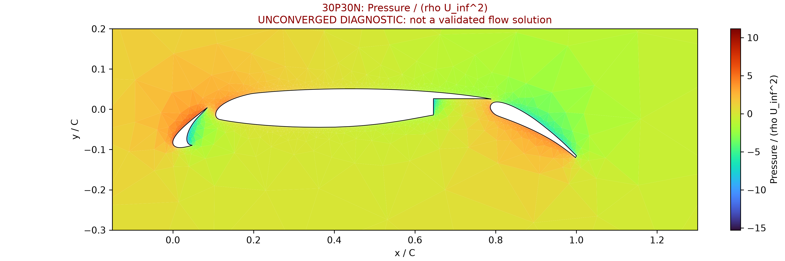

# 30P30N 三段翼 overset 验证

Problem: three distinct solid profiles (slat, main, flap), normalized chord.
One Gmsh fitted component contains all three physical walls and fluid slots;
a Cartesian background supplies the far field. This is a two-grid case,
not three independently moving fitted grids.

Equation: -Laplacian(u) = -4.
Exact field: u = 1 + x^2 + y^2 + 0.2xy + 0.1x + 0.15y.
Exact Dirichlet data apply only at physical walls and far-field boundaries.
Fringe values are unknowns constrained by ACTIVE donor interpolation.
Nonorthogonal FV fluxes and least-squares gradients are solved together.

Acceptance: both component volume-weighted L2 errors < 3%;
unique physical-domain integrated flux error < 3%; algebraic residual
and actual donor constraints < 1e-10. Independent NumPy replay checks
raw polygons, source profiles, gradients, fluxes and donor constraints.

Scope: scalar equation verification. No overset pressure, velocity, Cp,
lift/drag or turbulence validation is claimed. Point interpolation does
not provide strict local conservative interface flux coupling.

Geometry source: linuxguy123/30P-30N-Validation-Case (GPLv3).
Packaged profile files and exact numerical producer hashes are archived.

Reproduce from the repository:
PYTHONPATH=src python scripts/run_three_element_overset.py --output NEW_DIR
PYTHONPATH=src python scripts/audit_three_element_overset.py NEW_DIR
PYTHONPATH=src python scripts/report_three_element_overset.py NEW_DIR

| background_n | input_cells | maximum_relative_l2_error | global_balance_relative_error | independent_equation_max_residual | passed |
|---|---|---|---|---|---|
| 32 | 13388 | 0.013373023323663687 | 0.003980598476246738 | 2.8586955394017954e-13 | True |
| 64 | 34322 | 0.0027202613364316294 | 0.0008146563242529423 | 2.783426158829705e-13 | True |
| 128 | 110192 | 0.0006271944144338529 | 0.00018780649769704723 | 4.4452907067144e-13 | True |

[PDF](report.pdf)

## Mesh parameters and retained failures

Gmsh 4.15.2, one thread, first-order ASCII 2.2. Component domain [-1,3] × [-1.5,1.5]; background [-3,5] × [-3.5,3.5]; blanking rectangle [-0.5,2.5] × [-1,1]. For scale=128/n, wall tangential target=0.001 scale, outer target=0.03 scale, first layer=0.000025 scale, layer thickness=0.00025 scale, growth=1.2. Input profiles are piecewise linear; near-wall quadrilaterals and outer triangles come from Gmsh.

The initial 0.003C layer failed fine-grid edge recovery: [retained failure](../verification-overset-30p30n-failed/failure.json). The actual SIMPLE/SA flow remains unqualified: [bounded flow diagnostic](../verification-30p30n-flow-retry/report.md).

Regression evidence: 16 baseline tests and 9 multi-solid/overset tests passed (19 distinct tests, six repeated).

## 三段翼几何与实际流场图

[几何、速度和压力图](../verification-30p30n-flow-preview/visual-report.md)。流场来自19,023单元单套Gmsh贴体网格上两个完整SIMPLE/SA迭代步，仍未收敛，不能作为已达标的物理解。此图不是overset标量制造解，也不是overset Navier–Stokes结果。

