# NACA0012 body-fitted / Cartesian overset scalar verification

## Abstract and scope

Actual NACA0012 meshes with ordered wall quadrilaterals and outer triangles overlap a Cartesian background. The airfoil is rotated clockwise by 4 degrees about its quarter-chord point. Three coupled finite-volume diffusion systems are solved with active-only two-way donor constraints and independently replayed from raw arrays. This report qualifies static scalar diffusion and mesh connection. Incompressible Navier–Stokes, lift/drag/Cp, local conservative flux transfer, moving-grid GCL, turbulence and GPU performance remain unverified.

## Geometry and problem

Unit chord NACA0012 has unrotated leading edge (1.25,1.5) and quarter chord (1.5,1.5). Gmsh interpolating splines through 161 cosine-spaced profile points define the closed body. Actual wall edges are linear chords. The component occupies [0,4] x [0,3]; the Cartesian background occupies [-2,6] x [-2,5]. The blanking contour is [0.5,3.5] x [0.5,2.5]. One cell layer is FRINGE on each transfer boundary. All Cartesian cells touching the physical solid are excluded.

Solve -Laplacian(u)=-4 with analytic u=1+x²+y²+0.2xy+0.1x+0.15y. Analytic scalar Dirichlet data apply on the physical outer rectangle boundary and actual polygonal airfoil wall. The arbitrary scalar wall values are manufactured boundary data, and do not represent fluid no-slip. No analytic data are supplied to either artificial interpolation boundary.

## Numerical method

The shared Mesh2D adapter, Metric/evaluate/save_run, SHA256 provenance and figure modules are used. The [Gmsh BoundaryLayer/Distance/Threshold fields](https://gmsh.info/doc/texinfo/gmsh.html) generate the component mesh. First wall-layer thickness is 0.0005 times scale, growth 1.18, cap 0.025. Outer component size is limited to 0.06 times scale to preserve a resolved overlap. Tail fan and wake refinement are retained.

The original unlimited outer size produced 33 orphan background receivers at the coarse level and was rejected before a field solve. The actual failed geometry, source snapshot and error are preserved in ../verification-overset-naca-connectivity-failed. The corrected hierarchy has no orphans. This repair changes overlap resolution and leaves the physical geometry and manufactured equation fixed.

ACTIVE rows satisfy finite-volume diffusion with the full nonorthogonal flux correction. Least-squares cell gradients use adjacent available cells and physical Dirichlet boundaries. The face-area vector is decomposed into a centroid-connector component plus a tangential correction; both contributions are assembled into the same sparse matrix. FRINGE rows simultaneously constrain values to three ACTIVE donor centers on the other grid using nonnegative barycentric interpolation. The matrix is solved by SciPy spsolve; fields are actual numerical solutions, not analytic replacements.

The primary scalar error is the maximum of the two volume-weighted ACTIVE component L2 errors. Physical global balance uses the source integral once over the Cartesian rectangle minus the actual airfoil polygon. Point-value interpolation does not enforce strictly local interface flux equality, even when the global balance is accurate. No matched TensorLBM or commercial-software run is included.

## Software and independent verification

```bash
OMP_NUM_THREADS=1 OPENBLAS_NUM_THREADS=1 PYTHONPATH=src python scripts/run_naca_overset.py --levels 32 64 128 --output results/naca-overset
PYTHONPATH=src python scripts/audit_naca_overset.py results/naca-overset
PYTHONPATH=src python scripts/preserve_external_producer.py results/naca-overset
PYTHONPATH=src python -m tensorfvm.overset_naca_report results/naca-overset
```

The NumPy audit imports no production overset or scalar solver module. It reconstructs polygon areas, centroids, face incidence, LS gradients, complete nonorthogonal diffusion, physical boundary flux and all donor rows. A separately sampled 4097-point analytic NACA profile checks body vertices after inverse geometry rotation. Source/artifact snapshots preserve the actual numerical producer. Each component L2 error and unique-domain global diffusion balance must be strictly below 3%, while linear and donor residual limits are 1e-10.

## Results

|Background n|Input cells|ACTIVE cells|FRINGE cells|Max component L2 error|Global diffusion balance error|Linear residual|Accepted|
|---|---:|---:|---:|---:|---:|---:|---|
|32|4214|4014|104|0.666356%|0.488455%|7.14e-16|True|
|64|15253|14665|204|0.132834%|0.097665%|8.49e-16|True|
|128|58473|56530|407|0.029049%|0.021687%|1.37e-15|True|

Observed field-error orders: 2.3267, 2.1931. These are measured for this smooth static problem, and do not establish the order of a future Navier–Stokes overset solver. Independent raw-field replay passed: True.

## Discussion and next implementation gates

Field and unique-domain global balance errors decrease on all three levels. Local conservative interface fluxes require a separate transfer operator and validation; a small global defect does not certify that property. Next gates are a conservative flux correction, pressure/velocity coupling with independently audited mass balance, static laminar cylinder flow, and moving-body connectivity with geometric conservation. Industrial comparisons require matched physical cases and actual runs.

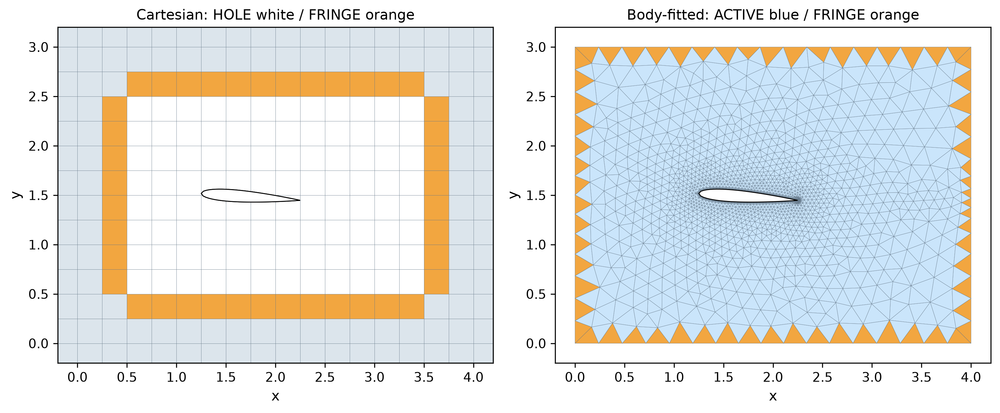

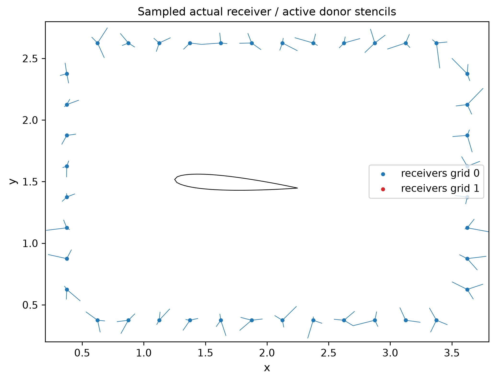


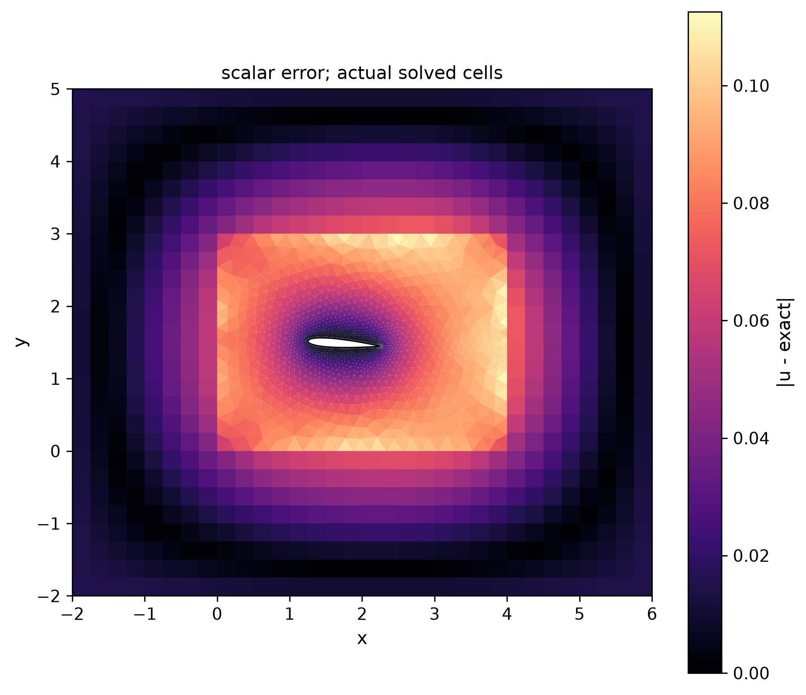

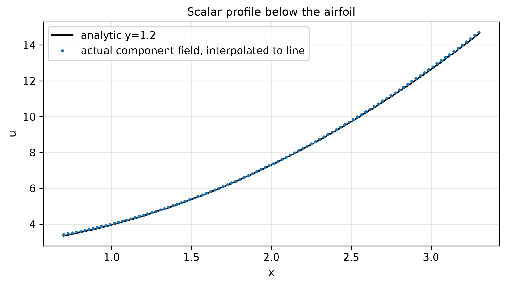

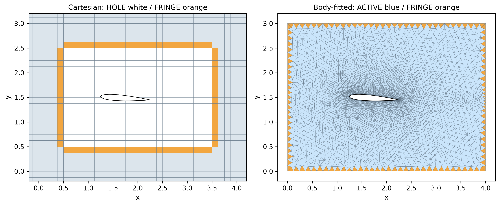

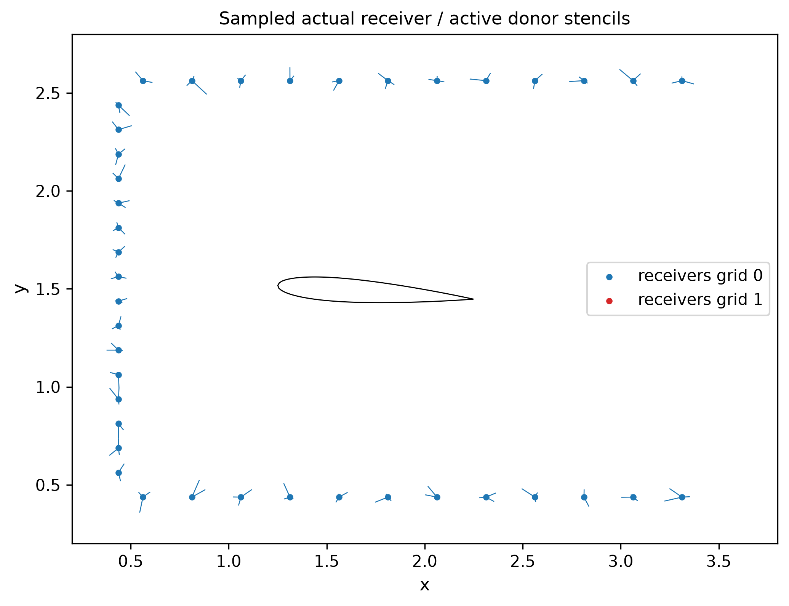

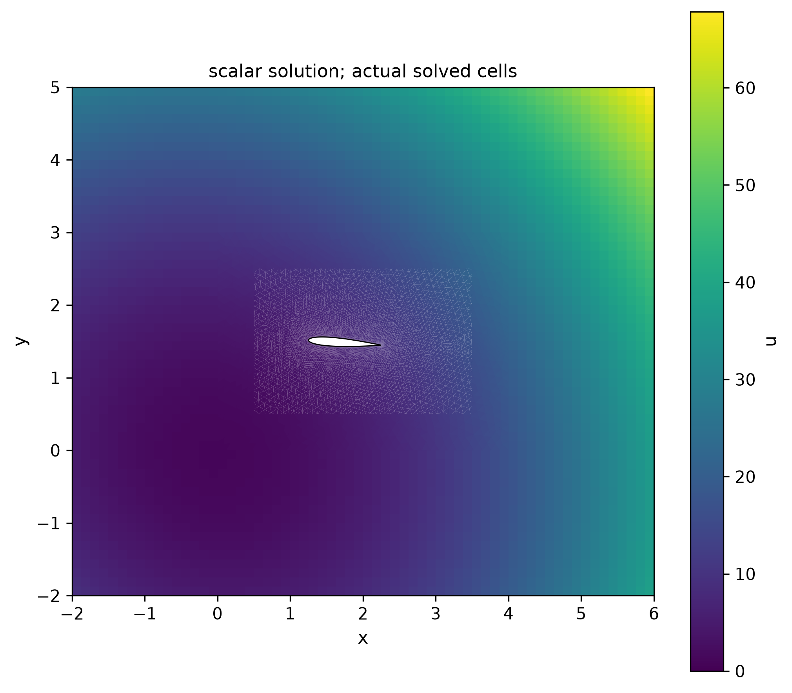


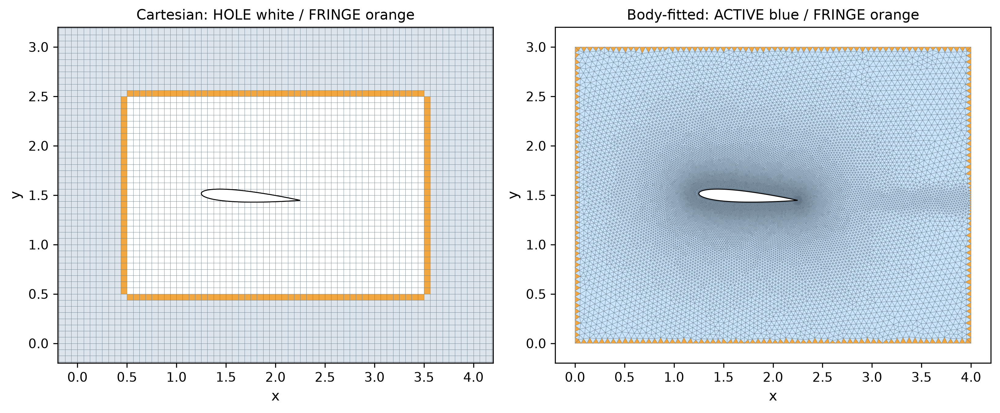

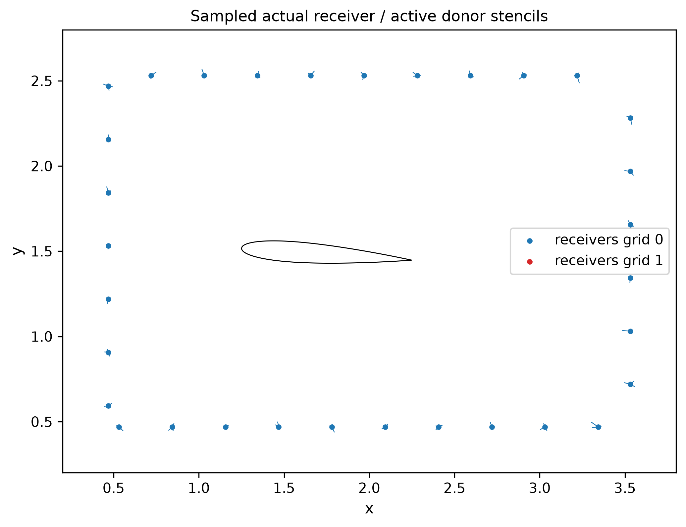

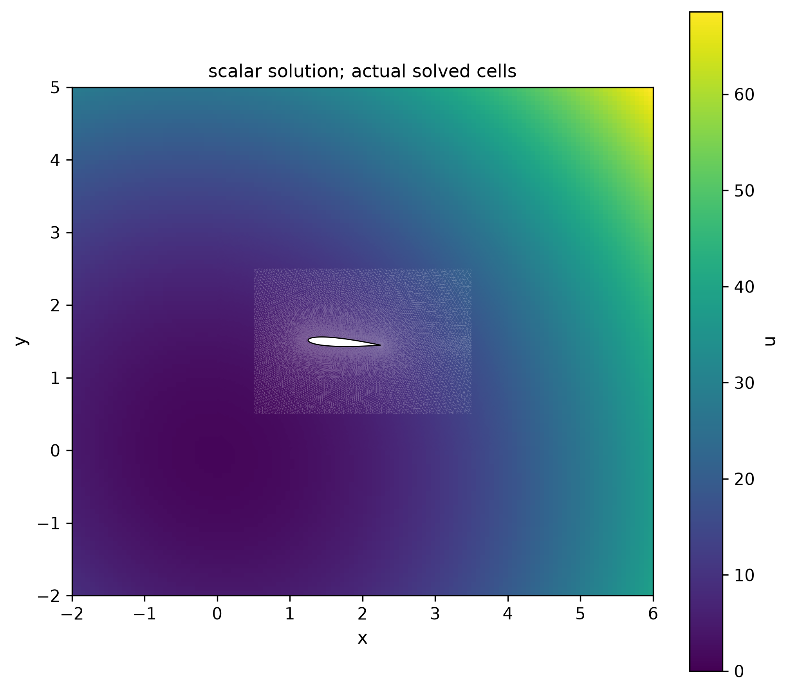

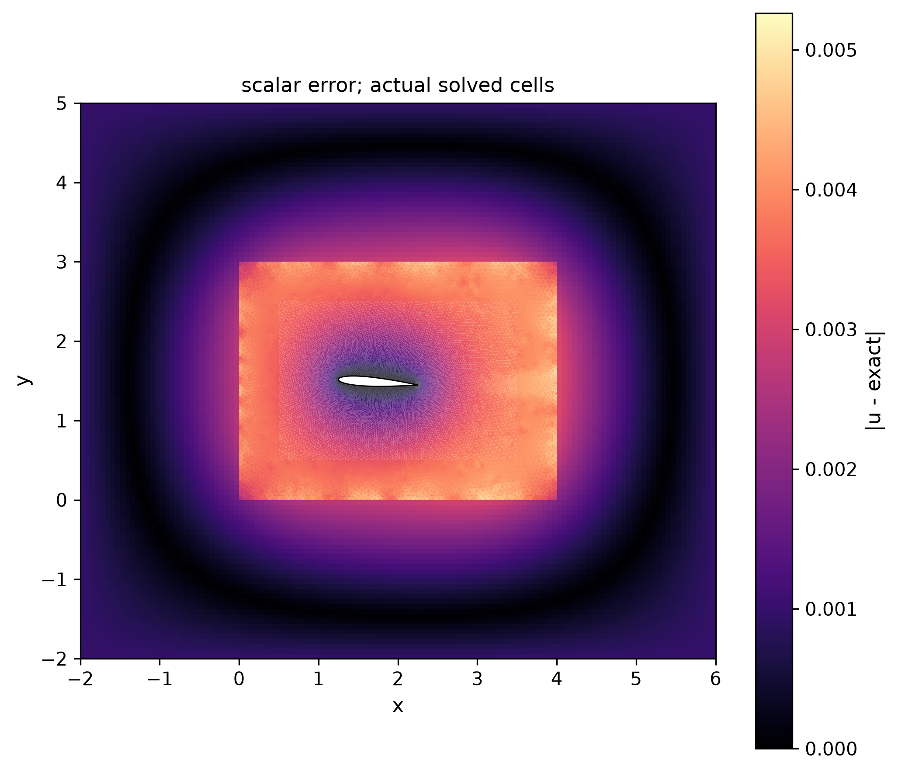

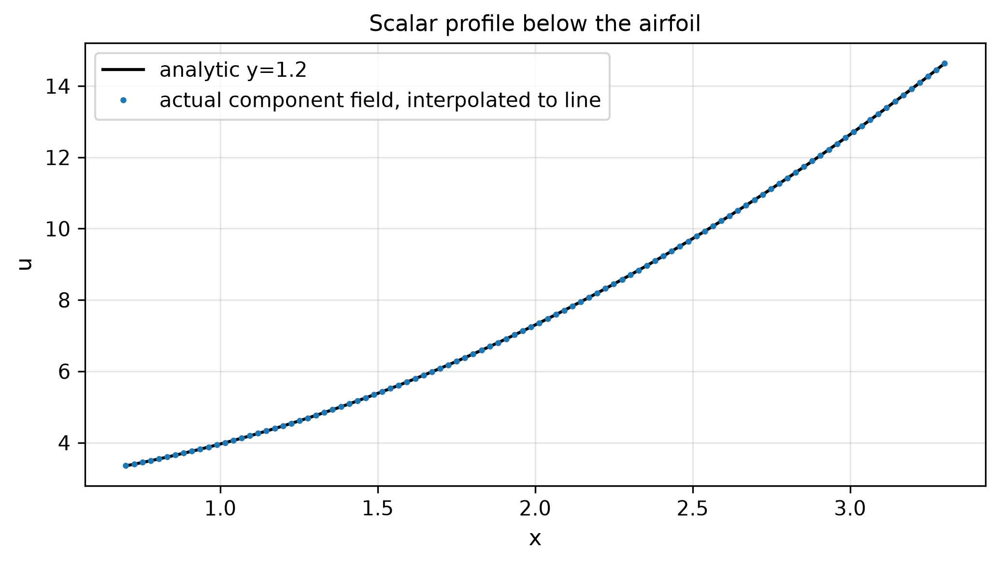

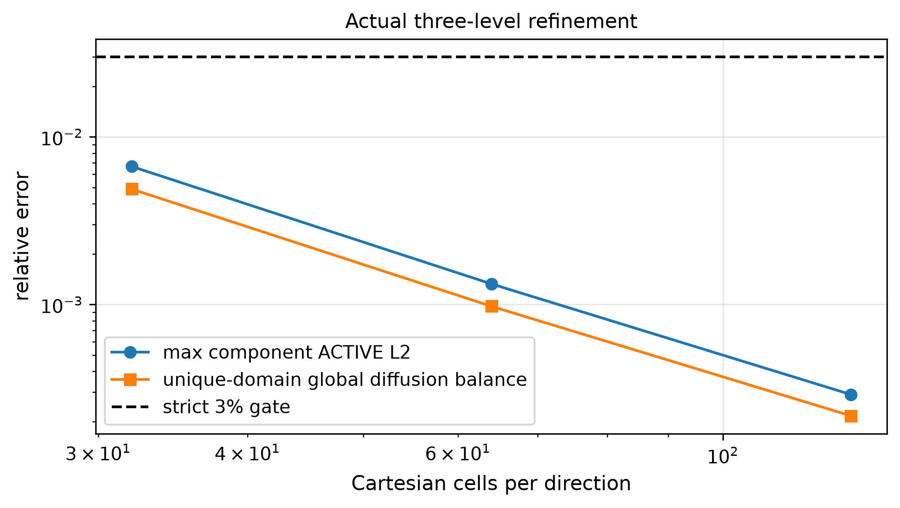
