# Static body-fitted / Cartesian overset finite-volume diffusion verification

## Abstract and scope

Two independently indexed grids cover a square with a stationary circular hole: an annular body-fitted component and a Cartesian background. Hole cutting, active-only donors, simultaneous fringe constraints and the actual finite-volume diffusion equations are exercised. This report qualifies scalar fields and a unique-domain global diffusion balance. It does not qualify incompressible Navier–Stokes, pressure/velocity coupling, strictly local conservative flux exchange, moving-grid GCL, turbulence or GPU acceleration. No matched TensorLBM run is included.

## Problem

The square is [-2,2] x [-2,2]; the body radius is R=0.3. The component extends to r=1; background blanking uses r=0.65. Actual physical wall edges are chords joining the annular inner vertices. The body polygon uses the same 2n vertices. One cell layer on both interpolation boundaries is FRINGE. Every Cartesian polygon that intersects the physical solid is blanked, even when its cell center is outside the solid. The physical wall is supplied by the annular grid.

Solve -Laplacian(u)=f with u=(x²+y²-R²)(1+0.2x+0.1y), f=-(4+1.6x+0.8y). The circular wall has homogeneous scalar Dirichlet data, and the square outer boundary has manufactured Dirichlet data. This scalar wall condition is not a fluid no-slip validation. Chord geometry differs from the ideal analytic circle and is refined together with the grids.

## Numerical method and software

Shared Metric/evaluate/save_run, provenance, artifact hashes and publication figures are used. Each ACTIVE control volume satisfies a two-point finite-volume diffusion equation. Each FRINGE row is a simultaneous weighted constraint from three ACTIVE centers of the other component, using nonnegative Delaunay barycentric weights. Weights reproduce constants and affine coordinates; orphan receivers and donor triangles crossing the excluded region are rejected. HOLE cells have inactive placeholder rows. The assembled sparse system is solved with SciPy spsolve. The Mesh2D adapter reuses actual TensorFVM polygons.

The official [OpenFOAM meshToMesh interface](https://github.com/OpenFOAM/OpenFOAM-dev/blob/master/src/meshTools/meshToMesh/meshToMesh.H) documents between-mesh addressing and weights. The current point-value implementation is independently written and supplies no certificate of conservative volume/flux transfer.

The primary field metric is the maximum of the two components' volume-weighted ACTIVE relative L2 errors. The optional combined norm counts overlap twice and is not a unique physical-domain norm. Physical global balance compares the summed outer/body diffusion flux with the source integrated once over the square minus the actual body polygon. The two fringe surfaces have different radii: their raw net flux is generally nonzero due to the overlap source and is not itself a conservation error. Point-value constraints do not guarantee matching local interface fluxes.

## Reproduction and independent audit

```bash
OMP_NUM_THREADS=1 OPENBLAS_NUM_THREADS=1 PYTHONPATH=src python scripts/run_overset_benchmark.py --levels 32 64 128 --output results/overset
PYTHONPATH=src python scripts/audit_overset_benchmark.py results/overset
PYTHONPATH=src python scripts/preserve_external_producer.py results/overset
PYTHONPATH=src python -m tensorfvm.overset_report results/overset
```

The independent audit imports no overset solver or connection module. It rebuilds signed areas, centroids, oriented faces, full ACTIVE diffusion residuals, physical boundary fluxes, unique-domain source moments and all donor constraints from saved polygons and stencils. Each component relative L2 error and physical global diffusion balance must be strictly below 3%, the coupled linear residual below 1e-10, and the donor constraint residual below 1e-10.

## Results

|Background n|Input cells|ACTIVE cells|FRINGE cells|Max component L2 error|Global diffusion balance error|Linear residual|Accepted|
|---|---:|---:|---:|---:|---:|---:|---|
|32|1536|1352|96|1.868277%|0.264841%|4.69e-16|True|
|64|6144|5624|188|0.334599%|0.052220%|6.75e-16|True|
|128|24576|22828|376|0.074072%|0.012200%|9.74e-16|True|

Observed field-error orders: 2.4812, 2.1754. These are measured for this smooth static problem, and do not establish the order of a future Navier–Stokes overset solver. Independent raw-field replay passed: True.

## Discussion and next implementation gates

Field and unique-domain global balance errors decrease on all three levels. Local conservative interface fluxes require a separate transfer operator and validation; a small global defect does not certify that property. Next gates are a conservative flux correction, pressure/velocity coupling with independently audited mass balance, static laminar cylinder flow, and moving-body connectivity with geometric conservation. Industrial comparisons require matched physical cases and actual runs.

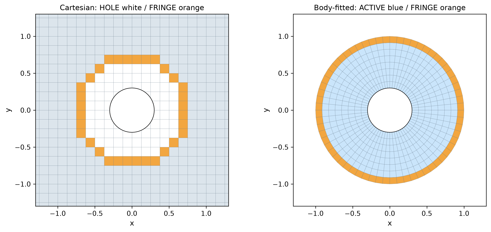

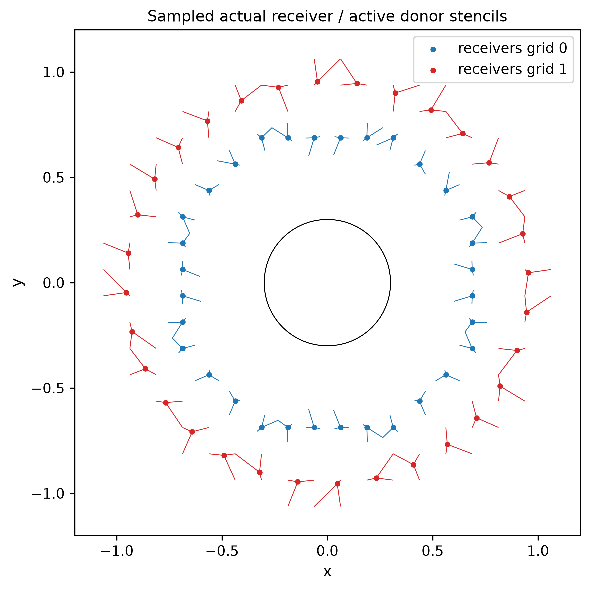

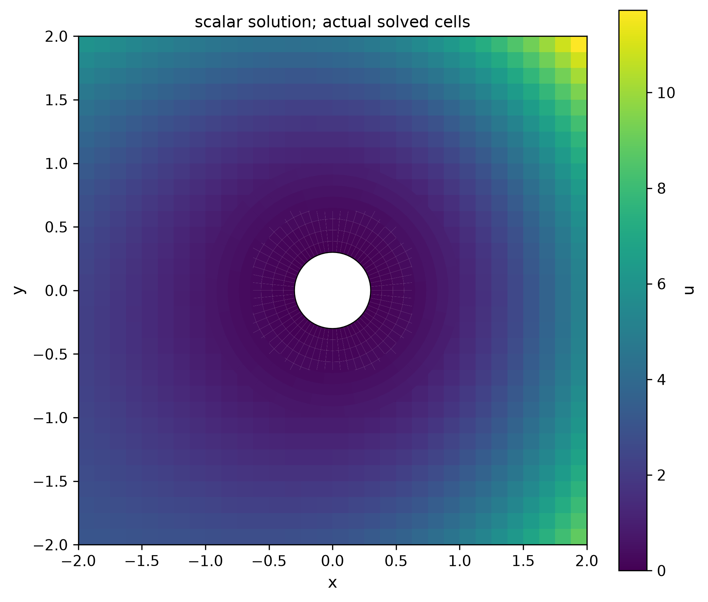

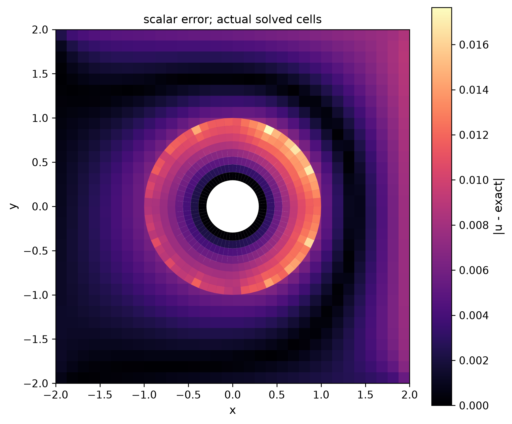

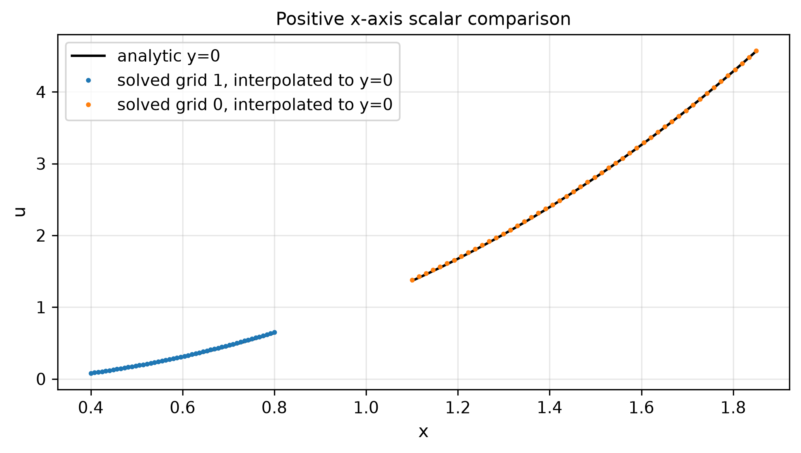

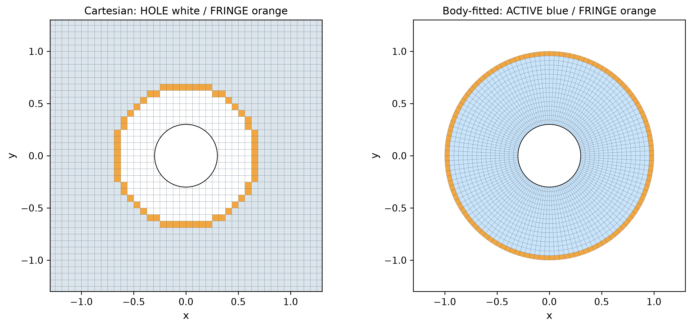

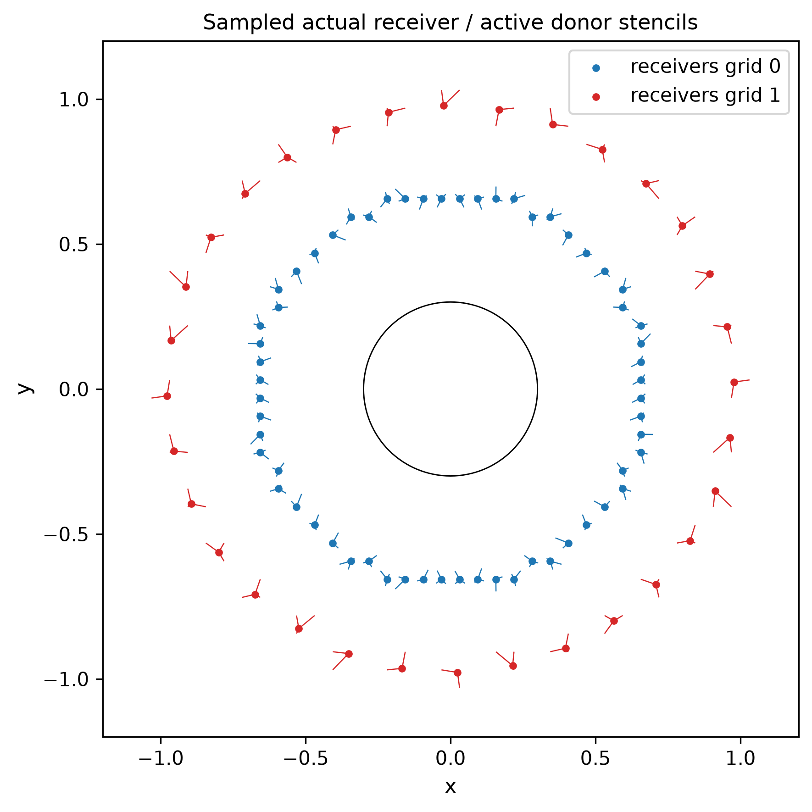


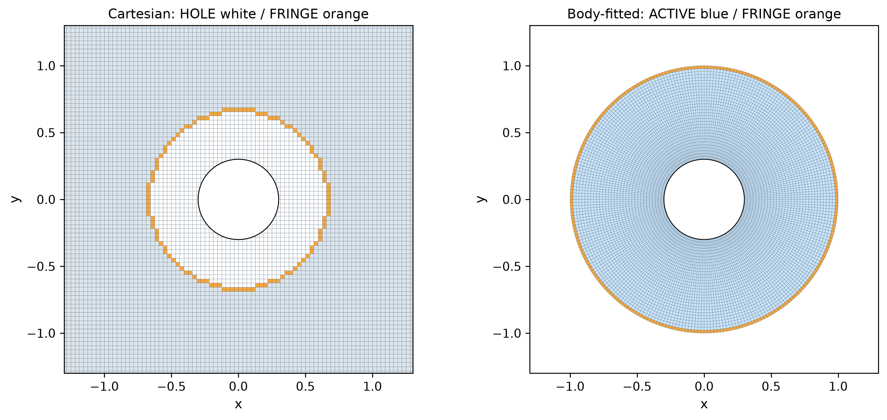

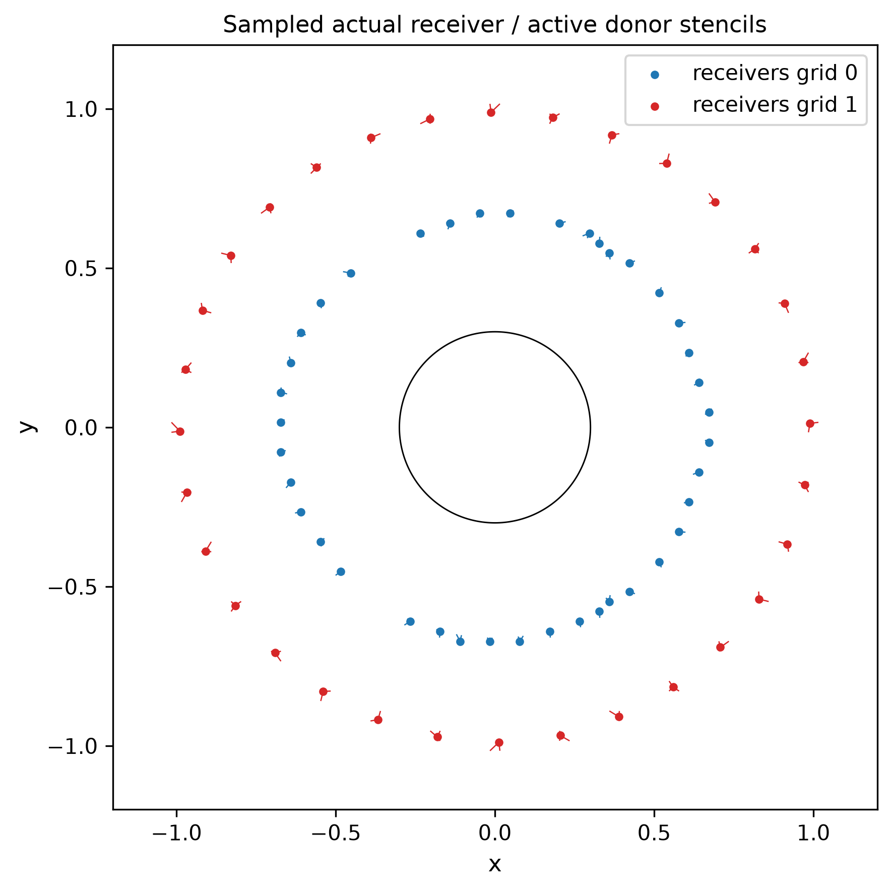

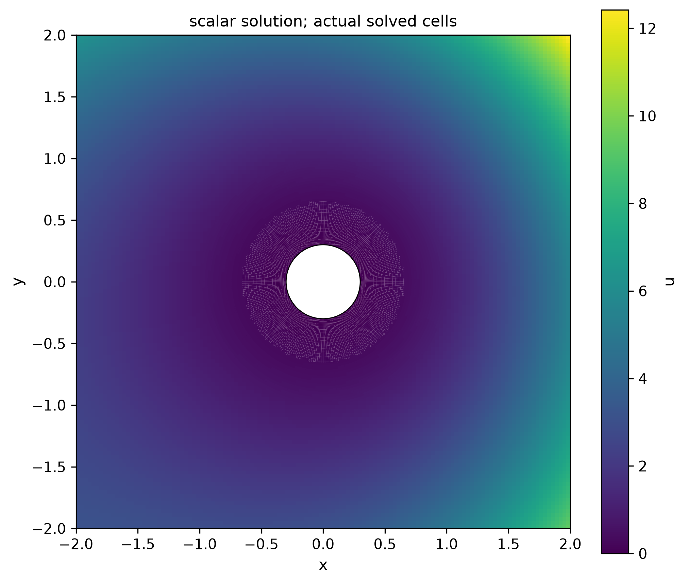

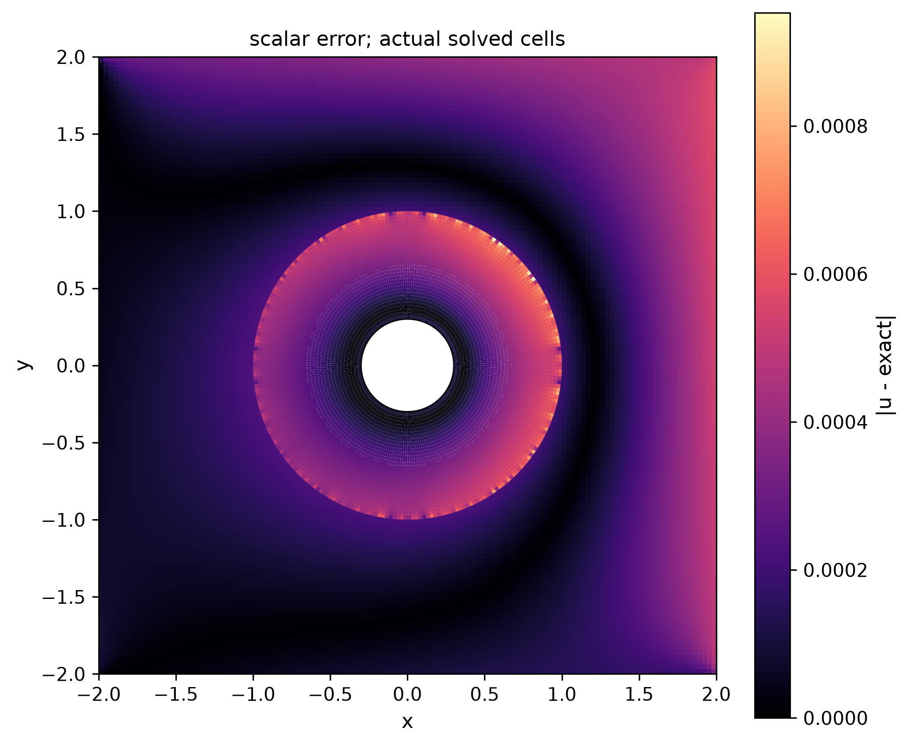


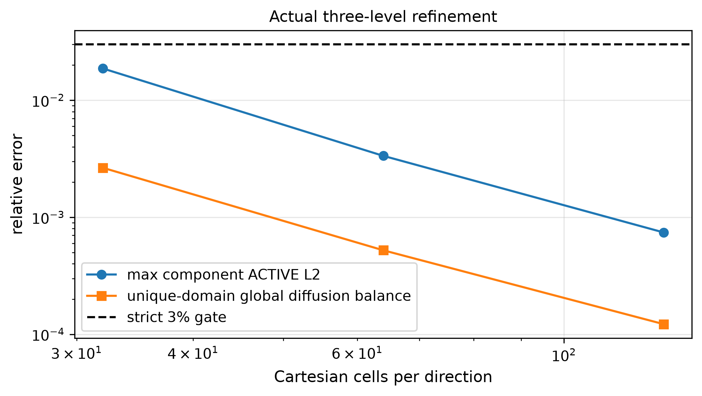
