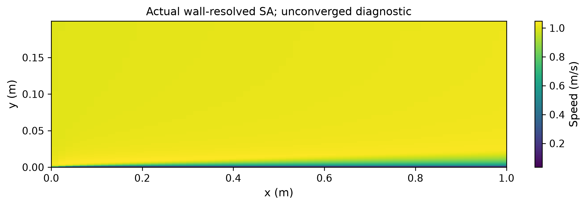
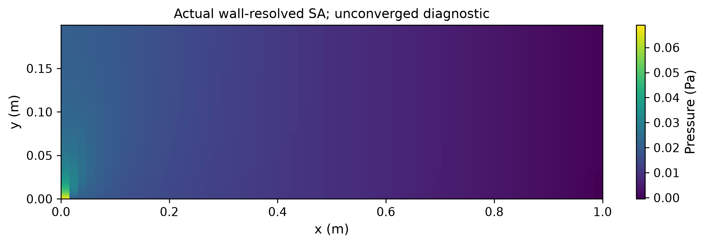
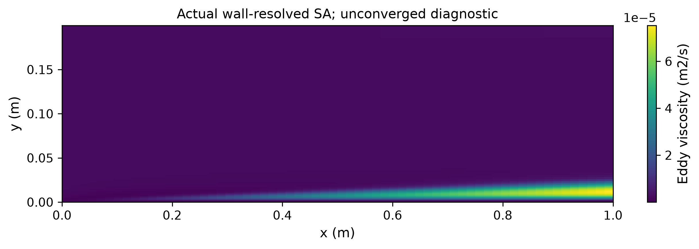
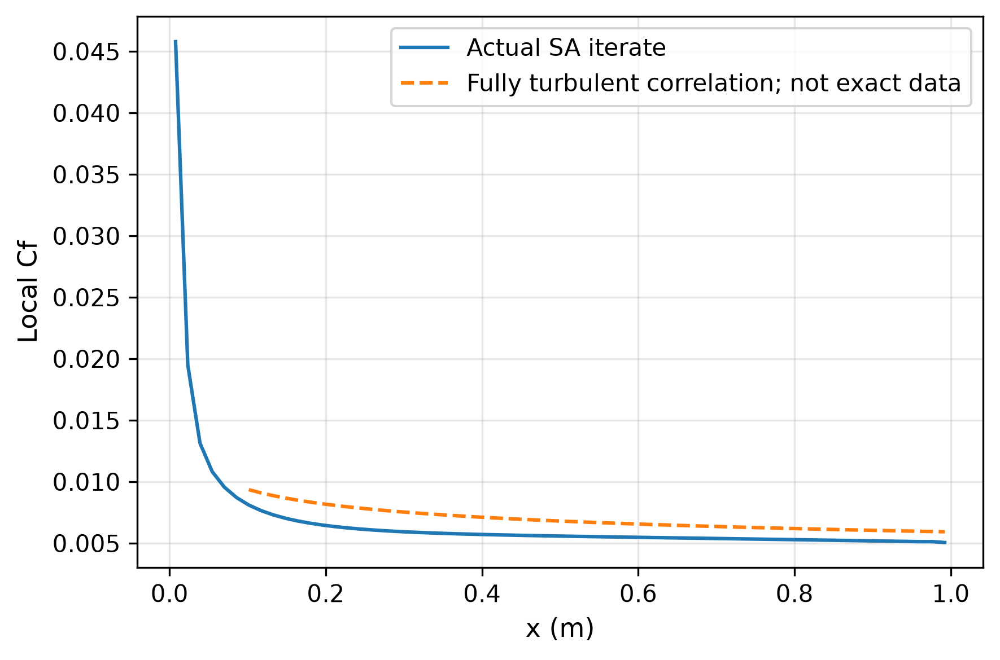

# SA 高雷诺数贴壁平板：严格门诊断

## 实际问题与结果

Re_L=100000，64×56，拉伸贴壁网格，现有生产SA原模型和SIMPLE，首层贴壁积分，没有壁面函数。实际运行1800次迭代；原20%门保留为历史门，本报告重新按3%物理门验收。

参考平均Cf=0.074 Re_L^(-1/5)为完全湍流经验关联式，不是逐点实验/DNS，低Re与转捩/模型差异会贡献误差。不能换参考或以宽门宣称3%通过。

- skin_friction_relative_error: 0.0722281087，门 0.03，通过 False
- solver_residual: 6.91502141e-05，门 1e-05，通过 False
- convergence_failure: 1，门 0.5，通过 False
- maximum_local_yplus: 2.09015512，门 1，通过 False

独立NumPy壁面牵引积分Cf=0.006865512，参考0.0074；总体通过：False。

## 原场、模型作用与限制

已保存u/v/p、nu_tilde/nu_t云图、局部Cf、每点y+与残差。nu_t非零说明模型实际参与方程，不能据此证明物理预测已准确。
独立壁面审计重建分子壁面剪切及切向梯度；压力对平直底壁的x向力为零。全1800次历史保留，审计不冒充独立重跑所有SA/SIMPLE步骤。
GPU报告另验证128×112网格的五次实际SA迭代及CPU/CUDA一致性；这也不代表稳态湍流已收敛。

下一步先解决原残差与迭代预算，再按[NASA TMR平板验证](https://tmbwg.github.io/turbmodels/flatplate_val.html)匹配入口、Re、边界和剖面数据。
SA贴壁与壁面函数方案需一致的输运边界后才能作同精度成本比较。

