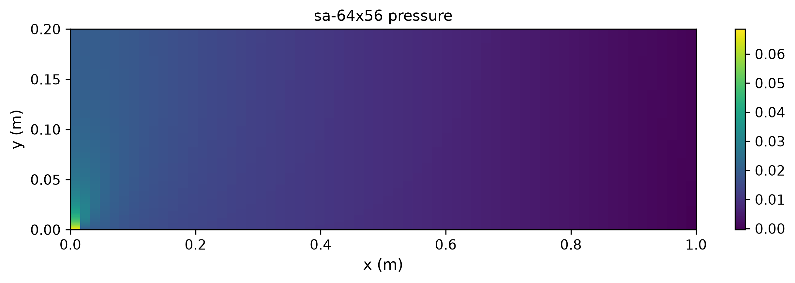
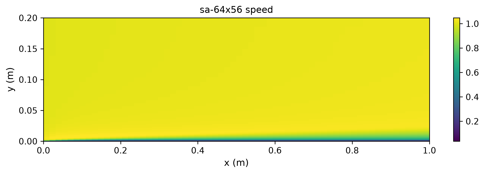
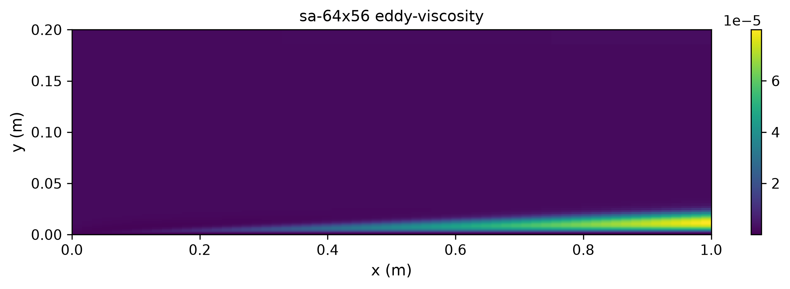
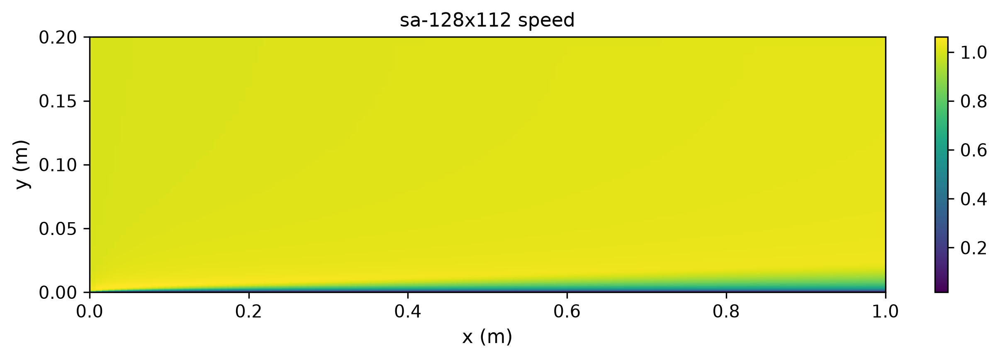
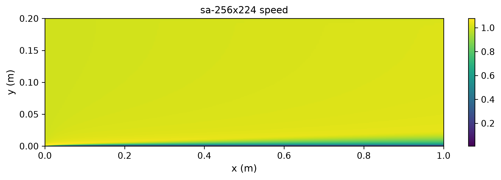
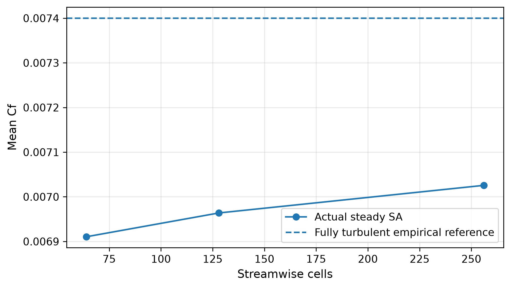
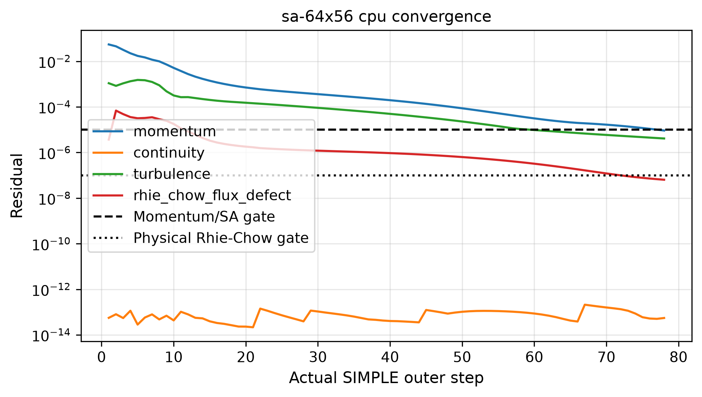
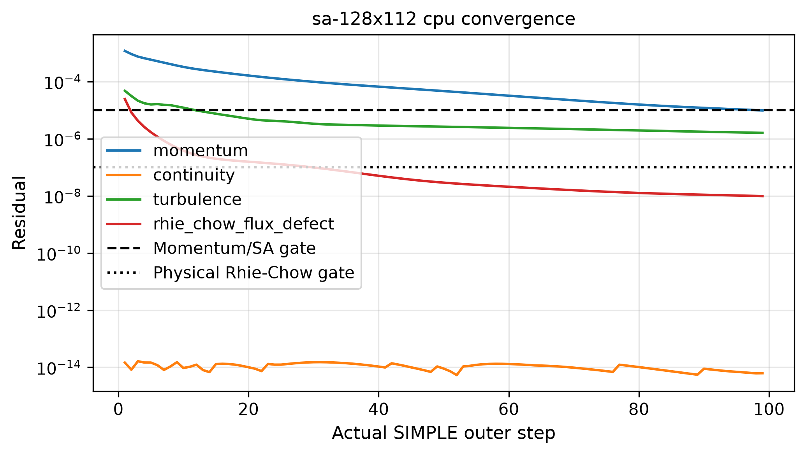
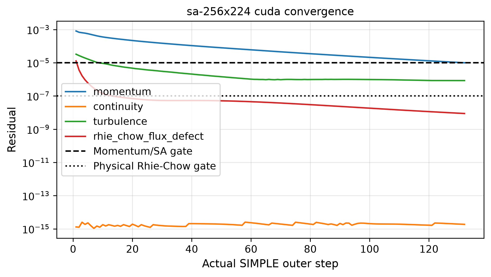
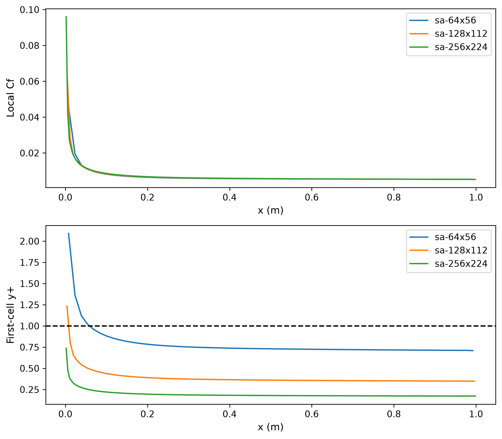

# SA 平板：优先物理验证的网格加密

Re=100000、L=1 m、H=0.2 m，原生产 SA 与首层贴壁条件不变；平均 Cf=0.074 Re^(-1/5) 为经验参考，不能代替匹配实验或 NASA TMR 条件。实际粗场初始化，包含ν̃插值；每级完整求解，未用解析流场。稳态残差、真实 Rhie–Chow 通量固定点和经验摩阻3%分别验收。64×56和128×112为实际CPU结果，256×224为实际CUDA结果，最细网格不声称两端一致性。较细CPU部分运行与原源码保留；采用32×28粗耦合网格加速，不改变原物理参数或方程。GPU一致性独立见64×56报告。

| 网格 | 收敛 | 步数 | Cf | Cf误差 |
|---|---|---:|---:|---:|
| sa-64x56 | True | 78 | 0.00691056 | 6.6141% |
| sa-128x112 | True | 99 | 0.00696384 | 5.8940% |
| sa-256x224 | True | 132 | 0.00702561 | 5.0593% |

















经验误差未通过的网格不计入正式合格 benchmark；加密不能自动证明参考工况匹配。首层 y+、局部 Cf 与独立非线性残差另见审计。

## 软件使用与原场审计

```sh
OMP_NUM_THREADS=1 MKL_NUM_THREADS=1 PYTHONPATH=src python scripts/verify_sa_mesh_refinement.py
PYTHONPATH=src python scripts/audit_steady_sa.py docs/verification-sa-refinement
PYTHONPATH=src python scripts/audit_simple_acceptance.py docs/verification-sa-refinement
```

网格敏感性按相邻网格实际 Cf 差报告，与经验关联误差分开：

| 相邻网格 | Cf相对变化 |
|---|---:|
| sa-64x56 → sa-128x112 | 0.765193% |
| sa-128x112 → sa-256x224 | 0.879203% |

这些计算使用原首层贴壁积分，没有壁面函数替代；不能证明完整壁面函数 RANS 已达标。两级CPU、一组CUDA，均使用实际设备；最细级没有CPU/CUDA一致性资格。求解单次时钟仅作诊断，计算期间有独立审计和绘图任务，不作为隔离的性能 benchmark。最大网格的变量数计入两个速度分量、压力、SA工作变量。









## 验收结论

三组均达到稳态门，但 Cf 经验误差均超过 3%，全部保留为未达标诊断。相邻网格 Cf 变化为 0.7652%、0.8792%，没有随加密持续减小；目前不能宣称渐近网格收敛，也不能把剩余误差直接归因于模型。最细最大 y+=0.736，仍需匹配公开工况、核对方程与边界，再决定下一组网格。
