# 完整贴体 SIMPLE：曲壁、非正交、大网格与稳态 SA 的 CPU/CUDA 验证

## 问题与方法

弯曲通道 x∈[0,2]、y∈[g(x),g(x)+1]，g=0.2 sin⁴(πx/2)。入口解析抛物线、曲壁无滑移、出口定压零且速度零法向梯度。制造解 u=w(y−g)、v=g′w、w=6η(1−η)、p=12μ(2−x)，体力由连续 Navier–Stokes 精确导出。曲壁保持不通透；这是含非零横向流和对流的连续制造解，不是无外力自然弯管流动。

复用生产 SIMPLE/Rhie–Chow、非正交修正、动量及 SA 方程；可选稀疏后端逐次核对组装压力矩阵与原矩阵自由算子。压力用行/粗网格预条件的 Torch GMRES，两端同算法，检查真实残差。CSR及粗矩阵在CPU组装并传输，线性迭代、预条件及场更新在实际 CPU/CUDA；不存在CPU线性求解回退。曲壁和 SA 使用可选的粗网格动量—压力耦合残差校正，不使用 Anderson；SA 每次外迭代最多八次真实输运子迭代。细网格以真正计算出的粗网格场插值启动；插值及粗校正后使用常mobility辅助速度投影，保持物理压力。额外设置1e−7的真实稳态Rhie–Chow通量固定点门，未使用解析场初始化。

SA仍是 Re=100000 的首层贴壁原模型；平均 Cf 的经验关联误差单独列出。稳态残差通过与 GPU 一致性通过，均不能代替3%物理门。

## 软件使用

```sh
OMP_NUM_THREADS=1 MKL_NUM_THREADS=1 PYTHONPATH=src python -m tensorfvm.verification.simple_gpu --output /tmp/fvm-simple-new
```

## 完整稳态结果

| 案例/网格 | CPU/CUDA迭代 | 两端收敛 | 物理3% | 最大主场相对差 | 五步窗口 CPU/CUDA |
|---|---:|---|---|---:|---:|
| curved-32x16 | 42/42 | True/True | True/True | 7.339e-15 | 0.678 |
| curved-64x32 | 43/43 | True/True | True/True | 3.191e-14 | 1.059 |
| curved-128x64 | 42/42 | True/True | True/True | 5.748e-14 | 1.985 |
| curved-256x128 | 119/119 | True/True | True/True | 2.496e-13 | 3.877 |
| sa-64x56 | 78/78 | True/True | False/False | 2.131e-13 | 1.269 |

## GPU计时范围与限制

每个配置都在CPU、CUDA完成真实稳态求解，计时含设置/网格/组装/实际线性求解/主机传输，不含绘图；完整求解时间是一次测量，不能称三次中位数。另以CPU实际中间场（残差第一次低于1e−3）作为双方相同重启，完整预热后各做三次五步SIMPLE窗口，包含CPU组装及传输，排除重启复制和绘图。窗口不是完整稳态求解时间；其速度比只代表该窗口。float64，单线程CPU，RTX3090；小网格可能减速。主场一致性统一≤1e−6。

完整 history、linear_history、原场、粗网格来源与窗口输出均保留。SIMPLEC/PISO/PIMPLE仍无独立生产实现，不能冒用这些名称。


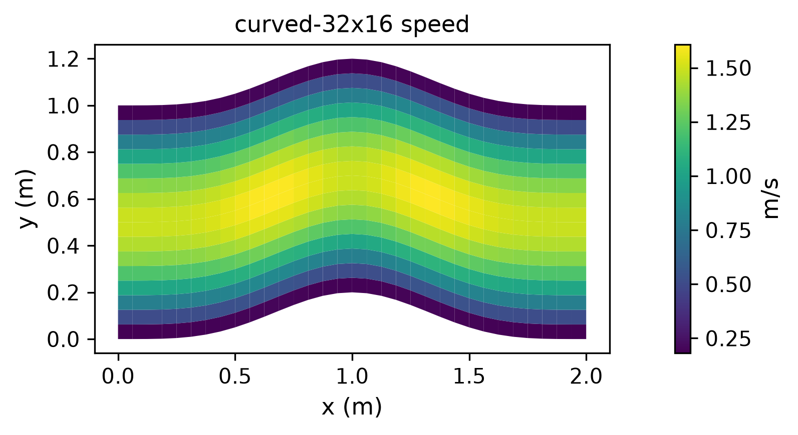

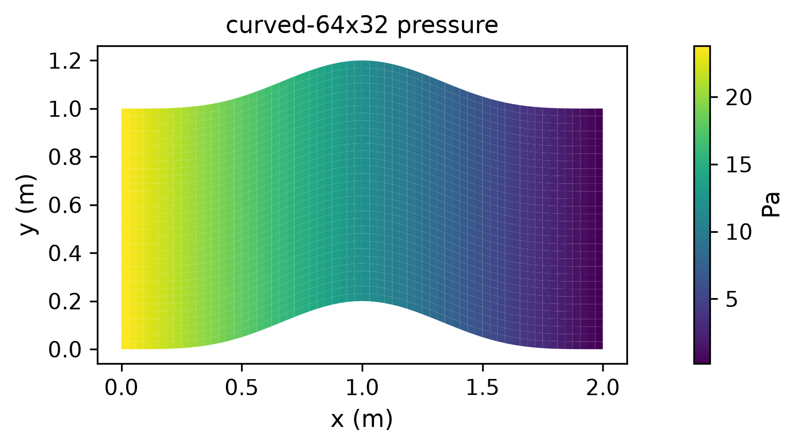


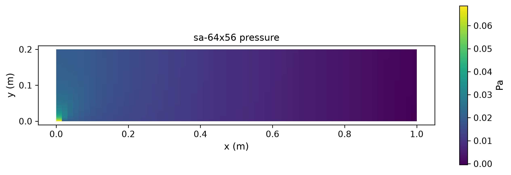

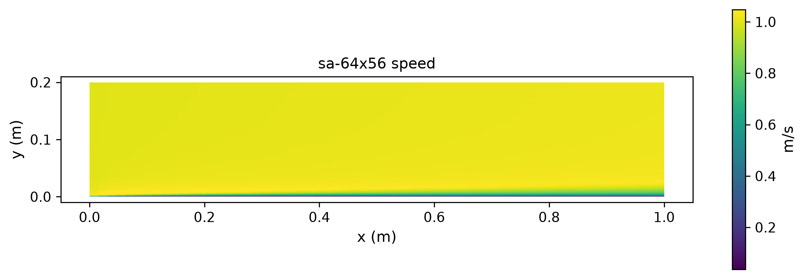

## 定量误差与完整求解成本

| 案例 | 控制体/主未知量 | 速度L2 | 压力L2 | CPU完整秒 | CUDA完整秒 |
|---|---:|---:|---:|---:|---:|
| curved-32x16 | 512/1536 | 0.420476% | 0.847160% | 2.917 | 4.640 |
| curved-64x32 | 2048/6144 | 0.159306% | 0.199764% | 5.507 | 4.904 |
| curved-128x64 | 8192/24576 | 0.074600% | 0.061110% | 14.379 | 7.138 |
| curved-256x128 | 32768/98304 | 0.037391% | 0.029793% | 162.052 | 42.013 |
| sa-64x56 | 3584/14336 | — | — | 25.948 | 20.229 |

曲壁动量采用生产迎风对流离散，因此按实际结果报告加密阶数，不预设速度必须二阶；体力按连续方程指定，压力全由SIMPLE求解。完整时间各一次；重复窗口性能见前表。

加密阶数：[{'coarse': 'curved-32x16', 'fine': 'curved-64x32', 'velocity_order': 1.4002218482639088, 'pressure_order': 2.084340495984423}, {'coarse': 'curved-64x32', 'fine': 'curved-128x64', 'velocity_order': 1.0945574347098734, 'pressure_order': 1.7088068299430292}, {'coarse': 'curved-128x64', 'fine': 'curved-256x128', 'velocity_order': 0.9964855941652889, 'pressure_order': 1.0364309082748524}]

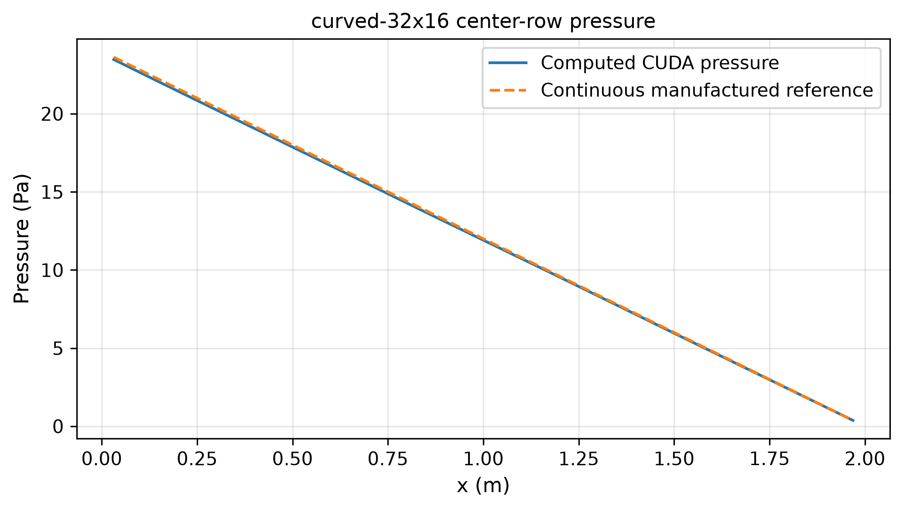

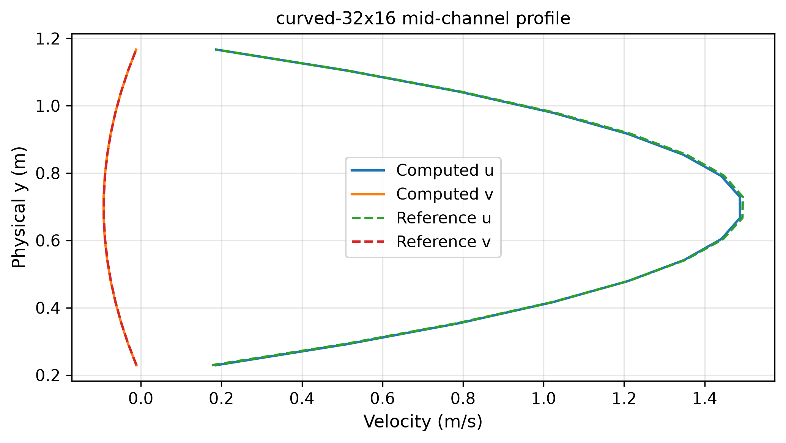

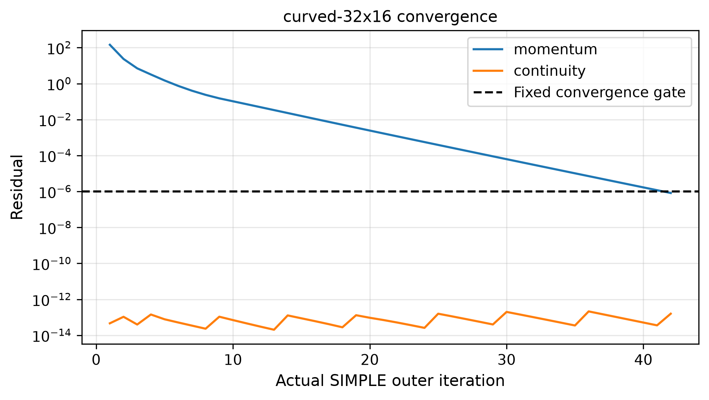

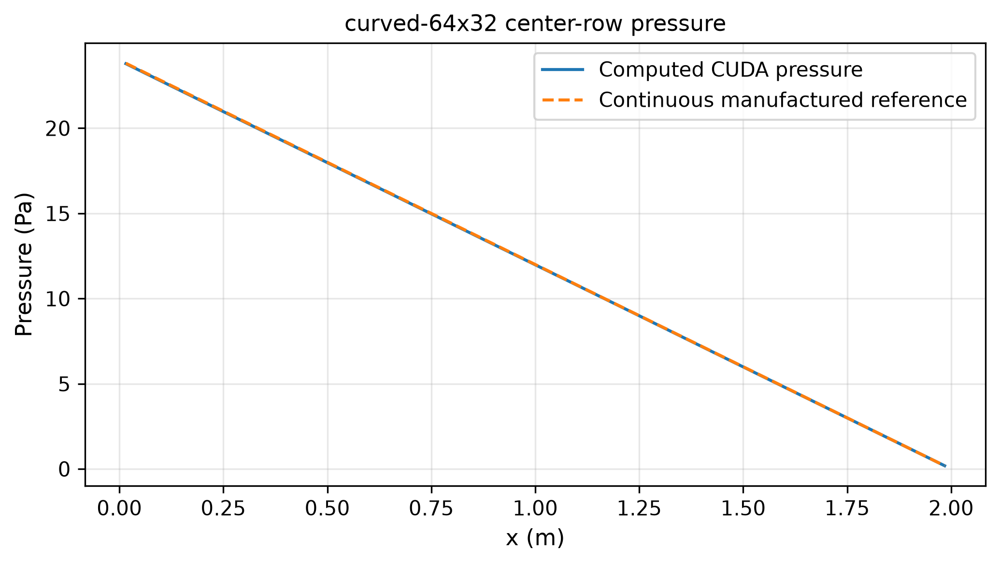

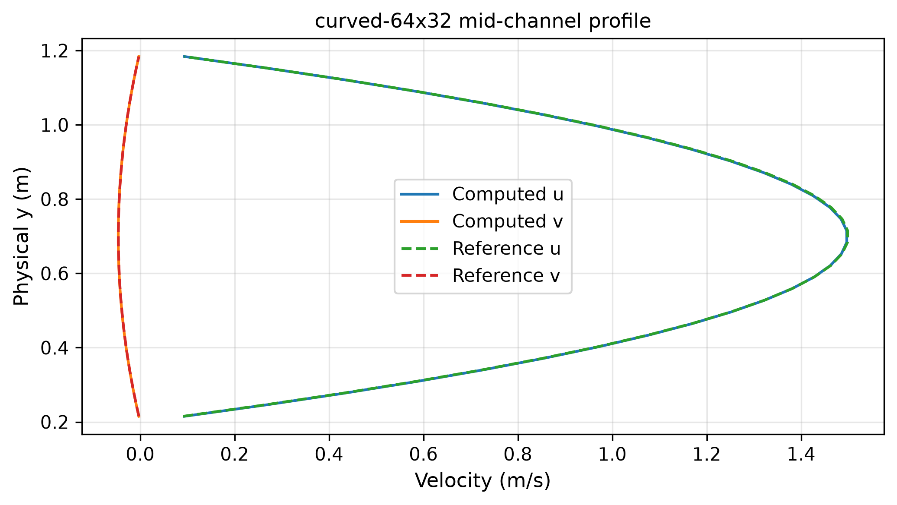

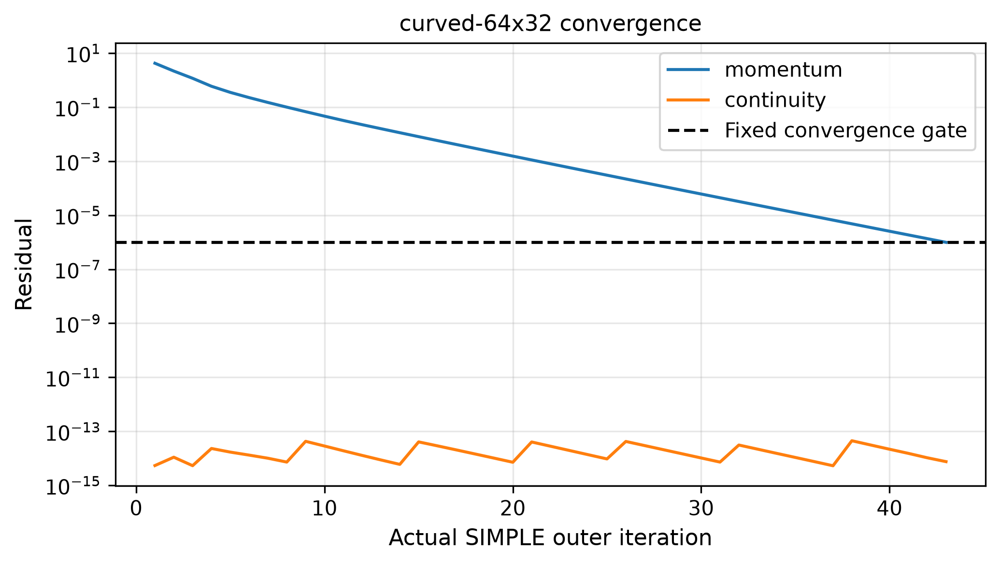


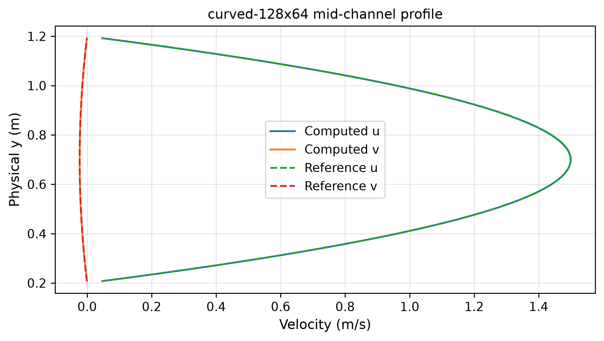


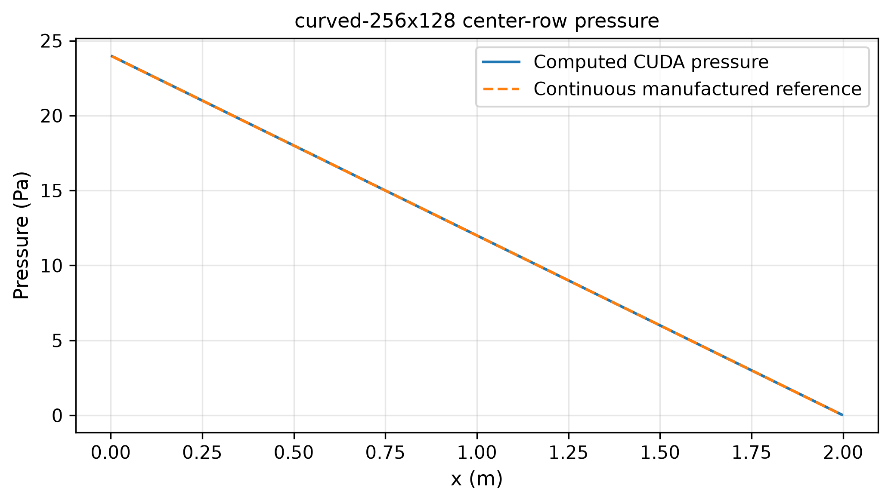

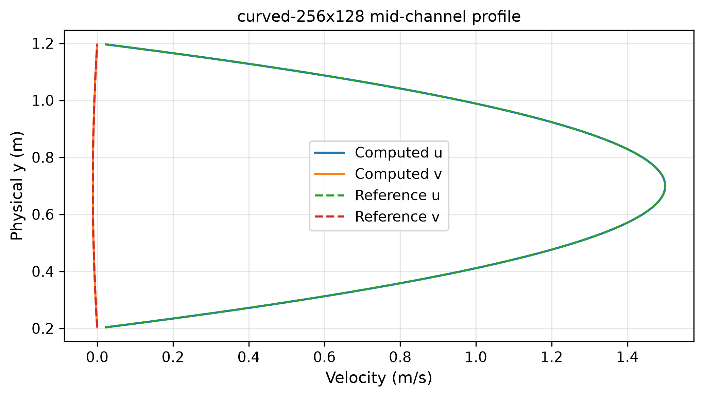

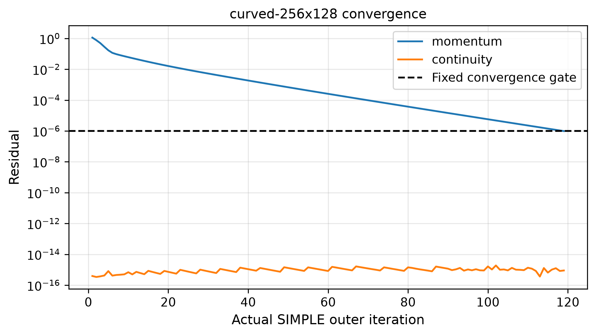

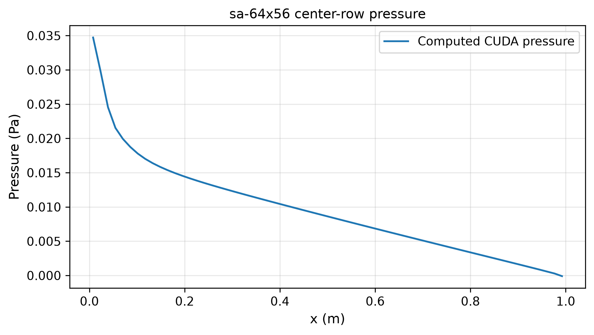

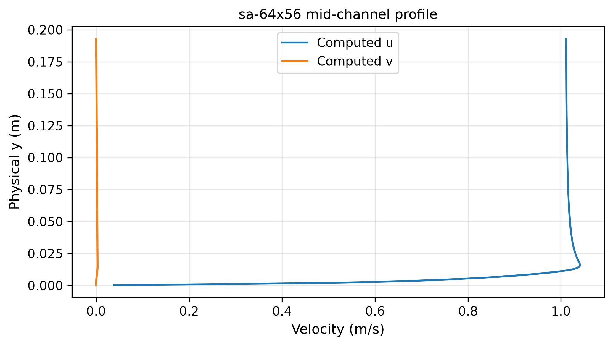

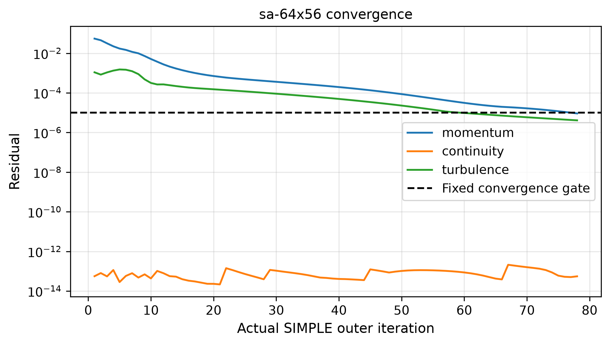

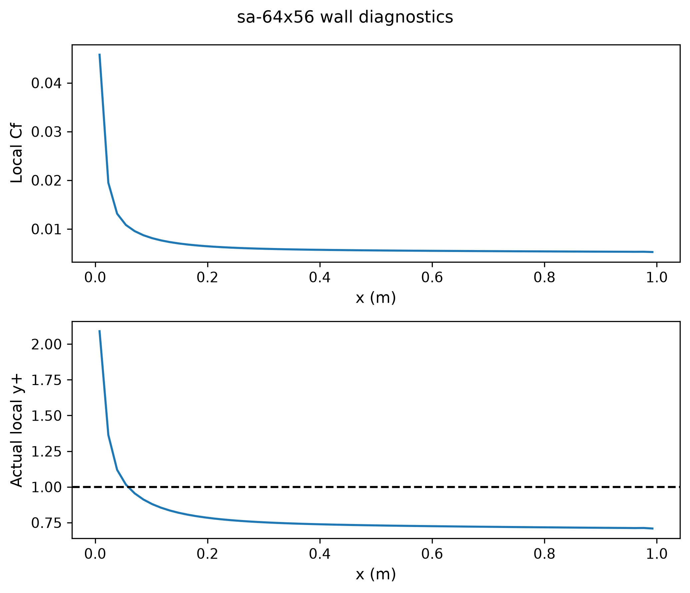
