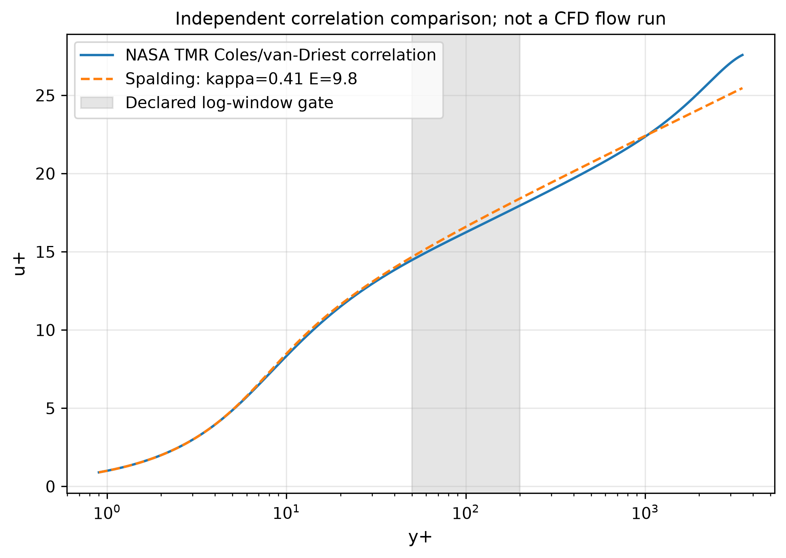

# 壁面函数与公开关联曲线对照

参考：[NASA TMR 的 Coles 速度律、含近壁 van-Driest 阻尼](https://tmbwg.github.io/turbmodels/flatplate_val.html)，Re_theta=10000。原始数据随包保存，来自官方新地址。

固定Spalding参数κ=0.41、E=9.8，未拟合参考。声明对数区50≤y+≤200；全曲线同时绘制，区外不宣称3%适用。两种近壁/外层模型不同，不能把该窗口通过当成分离/外层湍流或完整RANS准确性。

- log_window_uplus_l2: 1.938664%，严格<3%：True
- log_window_uplus_linf: 2.530206%，严格<3%：True

本模块反解与CPU/CUDA实际硬件验证另见大型网格与GPU报告。尚未接入原SA输运边界。
